# PLAN DE ACTUALIZACIÓN — RECOMENDACIÓN METODOLÓGICA, PERTINENCIA CONTEXTUAL, GAMIFICACIÓN Y GENERADOR DE PROMPTS EXTERNOS

**PlanificaIA — Generador ético de planificaciones educativas asistido por IA**
**Plan aditivo v1.0 · Fases U0–U17**

---

## 1. Portada

| Campo | Valor |
|---|---|
| **Nombre del proyecto** | PlanificaIA |
| **Documento** | Plan de actualización incremental (gamificación, metodologías contextuales, pertinencia TP/territorial, prompts externos) |
| **Naturaleza** | ADITIVO — no elimina, reemplaza ni degrada funcionalidad existente |
| **Principio rector** | “La IA propone, el sistema verifica y el docente decide” |
| **Estado del documento** | Propuesta de diseño — SIN implementar (ninguna función, colección o interfaz nueva se ha desplegado) |
| **Fecha de creación** | 2026-08-06 |
| **Autor** | Equipo multidisciplinario PlanificaIA |
| **Repositorio** | `planificacion-con-ia` (proyecto Firebase `planificacion-con-ia`) |
| **Referencias internas** | `RESUMEN_EJECUTIVO.md`, `PROJECT_MASTER_PLAN.md`, `PLAN_ESCALADO.md`, `ANALISIS_MEJORAS.md`, `MODELO_NEGOCIO.md`, `CONTROL_COSTOS.md`, `REVISION_JURIDICA.md`, `AGENTS.md`, `firestore.rules`, `functions/index.js`, `public/js/**` |

---

## 2. Estado del documento

- **Concepto aprobado:** no.
- **Arquitectura revisada:** parcial (borrador v1.0).
- **Implementación:** no iniciada. Pendiente de instrucción posterior explícita.
- **Prerrequisito:** la **Fase U0 (estabilización)** es bloqueante de cualquier despliegue nuevo de IA.

---

## 3. Control de versiones

| Versión | Fecha | Autor | Cambios |
|---|---|---|---|
| 0.1 (borrador) | 2026-08-06 | Equipo multidisciplinario | Primera versión íntegra: estabilización U0, motor metodológico, gamificación nativa/externa, prompts externos, pertinencia TP/territorial, datos, funciones, reglas, costos, pruebas, fases, backlog, riesgos, despliegue |

---

## 4. Resumen ejecutivo

PlanificaIA genera hoy planificaciones alineadas al currículum chileno con un verificador pedagógico determinista (V-001…V-016), rúbrica de calidad, trazabilidad de IA, colaboración UTP, planes Free/Pro y accesibilidad WCAG 2.2 AA.

Esta actualización añade, **sin tocar lo existente**, cuatro capacidades que operan **alrededor** de la planificación (que sigue siendo el objeto principal):

1. **Recomendación metodológica contextualizada** (`Methodology Recommendation Engine`): de 1 a 3 metodologías justificadas según OA, tiempo, recursos, modalidad, territorio y contexto TP; con aprobación docente obligatoria y opción de ignorarla.
2. **Experiencias gamificadas nativas**: experiencias simples (misiones, puntos, insignias, niveles, pistas, retroalimentación, evidencia textual) publicadas por enlace, código y QR, con portal de participante (invitado seudónimo, presentación en aula, equipos).
3. **Modalidad externa y generador de prompts** (`External Tool Prompt Generator`): paquetes específicos por herramienta (Genially, Canva, Prezi, Gamma evaluable, PowerPoint+Copilot futuro, genérico) para pegar/exportar, sin afirmar integraciones API inexistentes.
4. **Pertinencia TP y territorial**: contexto opcional de Educación Media Técnico-Profesional y de territorio, con separación estricta entre lo ingresado por el docente, lo recuperado de fuente oficial, la inferencia del modelo y el ejemplo genérico.

Todo se construye con **desarrollo aditivo** sobre componentes existentes (orquestación IA, costos, auditoría, PII, reglas, roles, planes, layout, wizard, editor, detalle) y **feature flags** que permiten desactivar cada módulo sin impedir la creación normal de planificaciones.

**Prioridad de ejecución:** estabilizar primero (U0 corrige riesgos de autorización, límites, costos y pruebas), expandir después.

---

## 5. Estado actual de PlanificaIA

Hechos verificados en el repositorio al 2026-08-06 (commit `585a4ee`):

- **Backend** `functions/index.js` (~2.460 líneas, ESM, Node 22, firebase-functions 7.3.2, firebase-admin 14.2.0).
  - 12 Cloud Functions `onCall` v2: `generatePlanning`, `regenerateSection`, `approvePlanning`, `submitFeedback`, `exportPlanning`, `acceptTerms`, `setUserPlan`, `setUserRole`, `createOrganization`, `inviteMember`, `acceptInvite`, `removeMember` + 1 `onDocumentCreated` (`onNewAuditLog`) + helpers exportados (`retentionCutoffIso`, `validateTermsAcceptance`, `runRetentionSweep`).
  - Proveedores IA: DeepSeek primario (`deepseek-chat`), Gemini fallback (`gemini-1.5-flash`). `generateFromProvider`, `callDeepSeek`, `callGemini` con cálculo de costo.
  - Pipeline: límite diario por plan (count en `ai-costs`), kill-switch de presupuesto (`budget-usage`), validación de entrada + PII (`sanitizeContextFields`) + prompt injection (`detectPromptInjection`), selección de plantilla en cascada (`prompt-templates`), `extractJson`, `normalizePlanningOutput`, `validateOutputStructure`, `runPedagogicalAudit` (V-001…V-016), `evaluateQuality` (rúbrica 8 criterios), `runCoherenceReview` (PT-007), trazabilidad en `ai-costs`/`audit-logs`.
  - 6 tipos: `class`, `unit`, `monthly`, `annual`, `evaluation`, `multigrade`.
- **Frontend** SPA sin build step: `public/js/core.js` (firebase, store, UI, Layout, catálogo, `PLANS`, términos), `public/js/app.js` (páginas ligeras + router con `import()` dinámico), `public/js/pages/{wizard,detail,editor,institucional}.js`.
  - Wizard 10 pasos; metodologías actuales del paso 4: `dialogada`, `abp` (etiquetado “Aprendizaje Basado en Problemas”), `cooperativo`, `indagacion`, `gamificacion`, `pensamiento-visible` (`wizard.js:215`); multi-metodología ≤4 para `unit`/`monthly`/`annual`.
  - `METHODOLOGY_KEYWORDS` (8 familias) para la regla V-013 (`functions/index.js:235`).
  - Paso 6 (evaluación) es decorativo; `snap.exists` usado como propiedad (`detail.js:21`, `editor.js:83`); `regenerateSectionFn` importado pero sin UI; `quality`/`coherenceReview` no renderizados.
- **Datos** `curriculum` (2.783 docs: 1.796 OA + 327 habilidades + 598 actitudes + 62 OAT), `catalog/subjects` (19 asignaturas, `country:'cl'`), `prompt-templates` (PT-001..PT-006 + por tipo).
- **Colecciones Firestore**: `users`, `plannings` (+`versions`, `comments`), `organizations` (+`members`, `invitations`), `curriculum`, `catalog`, `prompt-templates`, `audit-logs`, `ai-costs`, `budget-usage`, `error-logs`, `feedback`.
- **Reglas** `firestore.rules`: owner/admin/org-based; escritura de `audit-logs`/`ai-costs`/`budget-usage`/`feedback` solo desde Cloud Functions.
- **Pruebas**: 106 tests Jest (`functions/index.test.js`, patrón de espejo de helpers), 11 E2E Playwright (`frontend.test.py`, incluye axe-core WCAG 2.2 AA en 6 rutas), dataset 55 casos (global 4.91).
- **CI/CD**: `ci.yml` (unit + audit + E2E), `deploy.yml` (solo `hosting,functions`; la SA no tiene `Firebase Rules Admin` ni `cloudscheduler.jobs.update`).
- **Costos**: objetivo <$0.0005/generación; `MONTHLY_BUDGET_USD` (default 100).

### 5.1 Hechos verificados nuevos (2026-08-06)

| # | Hallazgo | Clase | Evidencia |
|---|---|---|---|
| V-01 | `rateLimiting: {maxCalls:10, periodSeconds:86400}` **no es opción válida de `onCall`/`HttpsOptions`** en firebase-functions 7.3.2 (solo existe `rateLimits` en Task Queues) → la opción es **inert** en JS; el único freno real al abuso es el count diario (no atómico). Agrava el conflicto con `PLANS.pro` (1.000/día). | `CORREGIR ANTES` | `functions/index.js:1342`; `firebase-functions/lib/v2/providers/https.d.ts` |
| V-02 | El modelo `deepseek-chat` ya no figura en la doc oficial DeepSeek (modelos vigentes: `deepseek-v4-flash`, `deepseek-v4-pro`). Riesgo de degradación/errores 404 si se retira el alias. Precios: v4-flash cache-miss $0.14/M input, $0.28/M output (iguales a los asumidos); aviso oficial de aumento de precios próximo. | `CORREGIR ANTES` / `POR VALIDAR` | api-docs.deepseek.com (2026-08-06) |
| V-03 | `gemini-1.5-flash` es modelo legacy; vigente: `gemini-2.5-flash` (contexto 1M, JSON con `responseSchema`). El fallback actual usa además la web API key de Firebase como clave Gemini (código muerto). | `CORREGIR ANTES` | cloud.google.com/gemini (2026-08-06); `functions/index.js:17-24` |
| V-04 | `regenerateSection` acepta `section` sin whitelist y hace `update[section] = newContent` → un propietario puede sobrescribir `status`/`approvedAt`/metadatos. | `CORREGIR ANTES` | `functions/index.js:1689-1734` |
| V-05 | `regenerateSection` y `runCoherenceReview` no registran costo en `ai-costs`/`budget-usage` → subcontabilización del presupuesto. | `CORREGIR ANTES` | `functions/index.js:1648-1741,1574-1600` |

---

## 6. Funcionalidades que NO deben alterarse

`NO TOCAR` — preservar comportamiento y contrato de datos de:

| Funcionalidad | Archivo / componente | Motivo |
|---|---|---|
| Seis tipos de planificación (`class|unit|monthly|annual|evaluation|multigrade`) | `functions/index.js`, `wizard.js`, `editor.js`, `detail.js` | Contrato del producto |
| Wizard de 10 pasos | `public/js/pages/wizard.js` | Flujo principal; la extensión es aditiva (sección 20) |
| Biblioteca curricular y catálogo dinámico | `curriculum`, `catalog`, `core.js` | Fuente única de OA |
| Editor manual y autosave | `editor.js` | `NO TOCAR` su flujo de guardado |
| Organizaciones, membresías, invitaciones, aprobación UTP | `functions/index.js` (S-3), `institucional.js`, `firestore.rules` | Base institucional |
| Exportación DOCX/PDF | `exportPlanning`, `buildDocxContent`, `detail.js` | Contrato existente |
| Verificadores V-001…V-016, rúbrica, PT-007 | `VALIDATION_RULES`, `evaluateQuality`, `runCoherenceReview` | Verificación pedagógica |
| Sanitización PII, prompt injection, PROMPT_GUARD | `sanitizeContextFields`, `detectPromptInjection` | Seguridad |
| Kill-switch de presupuesto y trazabilidad | `budget-usage`, `ai-costs`, `audit-logs` | Control de costos |
| Términos versionados y retención | `acceptTerms`, `runRetentionSweep` | Cumplimiento legal |
| Plantillas `prompt-templates` existentes | colección | No se reemplazan; se añaden nuevas (sección 36) |
| Reglas de Firestore actuales | `firestore.rules` | Se añaden `match` nuevos, sin modificar los existentes |
| Tests existentes | `index.test.js`, `frontend.test.py` | Deben seguir en verde (regresión = bloqueo) |

---

## 7. Hallazgos críticos previos (estabilización U0)

`CORREGIR ANTES` — ninguno de estos debe estar abierto para desplegar funciones nuevas de IA. Criterios verificables en la sección 47 (U0).

| # | Bloqueador | Detalle | Archivo:línea | Criterio de cierre | Estado |
|---|---|---|---|---|---|
| B1 | Whitelist de secciones en `regenerateSection` | `section` debe pertenecer a lista cerrada; bloquear `status`, `approvedAt`, `userId`, `orgId`, `version`, `aiContributions`, `warnings`, `quality`, `coherenceReview`, `createdAt` | `functions/index.js:1689-1734` | Test que rechaza sobrescritura de `status` y acepta solo secciones permitidas | ✅ Cerrado (2026-08-07) |
| B2 | Reconciliar rate limit técnico con planes | Retirar/ignorar `rateLimiting` no soportado (V-01) y dejar el límite diario gobernado por `PLANS` de forma atómica | `functions/index.js:1342` | El límite aplicado es el de `PLANS`; sin doble tope de 10 | ✅ Cerrado (2026-08-07) |
| B3 | Contador diario atómico | Reemplazar count+compare (race) por transacción sobre un doc diario por usuario (`ai-costs/…` o `usage/{uid}/{YYYY-MM-DD}`) | `functions/index.js:1371-1383` | Test de concurrencia (Promise.all) no excede el límite | ✅ Cerrado (2026-08-07) |
| B4 | Regeneraciones dentro del control de costos | `regenerateSection` debe registrar `ai-costs` + `budget-usage` | `functions/index.js:1648-1741` | `ai-costs` contiene fila por regeneración; kill-switch la considera | ✅ Cerrado (2026-08-07) |
| B5 | Contabilizar revisiones de coherencia | `runCoherenceReview` registra tokens/costo | `functions/index.js:1574-1600` | Fila de costo por revisión PT-007 | ✅ Cerrado (2026-08-07) |
| B6 | Configuración de Gemini | Retirar la web key de Firebase como clave Gemini; usar `GEMINI_API_KEY` real; evaluar `gemini-2.5-flash` con `responseSchema` | `functions/index.js:17-24,971-973` | Fallback verificado en staging con clave real | ✅ Cerrado (2026-08-07) |
| B7 | Verificar alias de modelo DeepSeek | Confirmar `deepseek-chat` vigente o migrar a `deepseek-v4-flash` (V-02) | `functions/index.js` | Smoke test real en staging; costos re-medidos | ✅ Cerrado (2026-08-07) |
| B8 | UI de regeneración por sección | Usar `regenerateSectionFn` (ya importado, sin invocar) con confirmación, resultado y aceptar/rechazar | `detail.js`, `wizard.js` | E2E: regenerar sección y verla persistida con `version+1` | ✅ Cerrado (2026-08-07) |
| B9 | Mostrar calidad y coherencia | Renderizar `planning.quality` y `planning.coherenceReview` en detalle | `detail.js` | E2E: score y veredicto visibles | ✅ Cerrado (2026-08-07) |
| B10 | Paso 6 del wizard (evaluación) | Vincular `<select>` a `data` y enviarlo en el payload | `wizard.js:310-315` | Test E2E: selección capturada en la planificación | ✅ Cerrado (2026-08-07) |
| B11 | `snap.exists()` | Usar método `exists()` en `detail.js:21` y `editor.js:83` | `detail.js`, `editor.js` | El estado “no encontrada” se muestra correctamente | ✅ Cerrado (2026-08-07) |
| B12 | Extraer lógica pura | Mover a módulo importable (p. ej. `functions/logic.js`) lo que hoy se duplica en `index.test.js` y `eval-batch.mjs`; aislar `initializeApp()` | `functions/index.js`, `index.test.js` | `index.test.js` importa la lógica en vez de espejarla | ✅ Cerrado (2026-08-07) |

**Regla de oro:** ninguna función nueva de IA se despliega si B1–B7 están abiertos (afectan autorización, aprobación, costos, límites, trazabilidad, persistencia o pruebas).

---

## 8. Visión de la actualización

> De **generador de planificaciones** a **plataforma que ayuda al profesor a decidir y a crear**: qué metodología usar y por qué, con qué recursos, cómo en su contexto (TP/territorial), con o sin tecnología, cómo transformar una actividad en una experiencia gamificada, cómo publicarla y cómo llevarla a una herramienta externa.

La planificación sigue siendo el objeto principal. La gamificación, los prompts externos y la recomendación metodológica son **derivaciones opcionales** y **nunca** sobrescriben el objeto fuente.

Derivaciones posibles de gamificación: una planificación · una actividad · una clase · una unidad · un OA · una secuencia · un proyecto · una evaluación formativa.

---

## 9. Alcance

`MVP` (U1–U17):

- Motor de recomendación metodológica híbrido (reglas + IA explicativa), 1–3 recomendaciones, aprobación docente.
- Catálogo metodológico con la nomenclatura de la sección 13.
- Contexto ampliado: recursos tecnológicos, territorio (opcional), TP (opcional).
- Variantes tecnológicas A/B/C/D de una misma actividad.
- Gamificación nativa simple (misiones, puntos, insignias internas, niveles, pistas, retroalimentación, evidencia textual, preguntas, reflexión), publicación por enlace + código + QR, portal de participante en modo invitado seudónimo, presentación en aula y equipos básicos.
- Modalidad externa: generador de prompts para Genially, Canva, Prezi y herramienta genérica; Gamma como opción evaluable; exportación a texto/Markdown/TXT/DOCX/JSON.
- Verificador pedagógico de gamificación (`GamificationReview`) con errores/advertencias/sugerencias/información.
- Trazabilidad, costos, auditoría y retención de los nuevos flujos.
- Accesibilidad WCAG 2.2 AA de los nuevos módulos.

`FUTURO` (post-v1.0 de esta actualización): modo participante con cuenta; economías virtuales; geolocalización; ranking público; marketplace; agentes; reglas programables; paquete ZIP; más herramientas (PowerPoint+Copilot, Gamma productivo); multi-idioma; dashboard de analítica avanzada.

---

## 10. Fuera de alcance

- Chat, videollamadas, avatares 3D, cajas de botín, pagos/microtransacciones.
- Integraciones API con Genially/Canva/Prezi/Gamma (solo generación de prompts y guiones, `REQUERIMIENTO ÉTICO`: no afirmar integración inexistente).
- Geolocalización y datos individualizados de estudiantes.
- Migración de stack, proveedor o infraestructura.
- Reescritura del wizard o del editor.
- Diagnósticos clínicos de estudiantes (prohibidos por diseño, PR004).

---

## 11. Principios

`REQUERIMIENTO PEDAGÓGICO` · `REQUERIMIENTO ÉTICO`

| ID | Principio | Aplicación en la actualización |
|---|---|---|
| P-A1 | La IA propone, el docente decide | Recomendaciones, variantes, gamificaciones y prompts siempre revisables/aprobables por el docente |
| P-A2 | No bloquear por desacuerdo | El docente puede rechazar/reemplazar/ignorar una recomendación sin impedir la planificación |
| P-A3 | Hechos vs. inferencias | Separar contexto ingresado, fuente oficial, inferencia del modelo y ejemplo genérico |
| P-A4 | La gamificación no garantiza aprendizaje | El verificador entrega niveles de severidad; nunca afirma “pedagógicamente correcta” |
| P-A5 | Datos mínimos de menores | Portal de participante sin correo, sin nombre completo, sin datos individualizados |
| P-A6 | Privacidad por diseño y por defecto | Sin PII en prompts; retención limitada; consentimiento cuando aplique (Ley 21.719) |
| P-A7 | Equidad | Las experiencias no excluyen por desempeño ni por dispositivo |
| P-A8 | Costos gobernados | Toda llamada IA nueva bajo presupuesto, kill-switch, límites por plan y trazabilidad |
| P-A9 | Accesibilidad como requisito, no adorno | WCAG 2.2 AA en todos los flujos nuevos |
| P-A10 | Aditividad | Ningún cambio rompe el comportamiento existente (regresión = fallo de QA) |

---

## 12. Usuarios

| Rol | Necesidad en esta actualización |
|---|---|
| Docente de aula | Elegir metodología justificada, variantes por recursos, gamificar, publicar con QR |
| Docente EMTP | Vincular formación general con especialidad/módulos sin forzar simulaciones |
| Docente rural / baja conectividad | Alternativas sin multimedia y modos offline |
| Educador diferencial | DUA aplicado a recomendaciones, variantes y experiencias |
| Coordinador UTP / Jefe UTP | Revisar y aprobar (flujo existente S-3), supervisar experiencias publicadas |
| Estudiante (participante) | Ingresar con código + alias; completar misiones; sin cuenta ni datos personales |
| Equipo directivo | Visión agregada (analítica básica) |
| Admin | Gestionar feature flags, catálogos y costos |

---

## 13. Metodologías — nomenclatura

`CREAR` catálogo interno con códigos estables; en la **interfaz se muestran nombres completos** (nunca solo la sigla).

| Código interno | Nombre de interfaz | Relación con lo existente |
|---|---|---|
| `ABPROY` | Aprendizaje Basado en Proyectos | `EXTENDER` (desambigua el actual `abp`) |
| `ABPROB` | Aprendizaje Basado en Problemas | `EXTENDER` (desambigua el actual `abp`) |
| `ABJ` | Aprendizaje Basado en Juegos | `CREAR` (distinto de gamificación) |
| `APS` | Aprendizaje-Servicio | `CREAR` |
| `GAM` | Gamificación | `EXTENDER` (actual `gamificacion`) |
| `ACOOP` | Aprendizaje Cooperativo | `REUTILIZAR` (actual `cooperativo`) |
| `IND` | Indagación | `REUTILIZAR` (actual `indagacion`) |
| `EC` | Estudio de Casos | `CREAR` |
| `SIM` | Simulación | `CREAR` |
| `RETOS` | Aprendizaje Basado en Retos | `CREAR` |
| `AULA_INV` | Aula Invertida | `CREAR` |
| `ESTACIONES` | Estaciones de aprendizaje | `CREAR` |
| `FUENTES` | Trabajo con fuentes | `CREAR` |
| `DEBATE` | Debate estructurado | `CREAR` |
| `DIRECTA` | Enseñanza explícita / instrucción directa | `REUTILIZAR` (actual `dialogada`) |
| `MIXTA` | Combinación metodológica justificada | `CREAR` (solo si se justifica) |
| `PVISIBLE` | Pensamiento Visible (auxiliar) | `EXTENDER` (actual `pensamiento-visible`; se conserva como etiqueta de rutinas, no como método primario) |

**Retrocompatibilidad** (`REUTILIZAR`): el paso 4 actual envía `methodologies` con valores actuales; el catálogo incluye el campo `legacyKeys` para mapear `abp → [ABPROY, ABPROB]`, `dialogada → DIRECTA`, etc. La regla V-013 se amplía (`EXTENDER`) para reconocer los nuevos códigos y sus familias sin romper los tests existentes. `REQUERIMIENTO PEDAGÓGICO`: `MIXTA` solo se ofrece como combinación docente justificada, nunca por defecto.

---

## 14. Motor de recomendaciones — `Methodology Recommendation Engine`

### 14.1 Comportamiento

- Opera **antes de generar** (paso 4 del wizard) y **sobre una planificación existente** (detalle/editor).
- Entrega **1 a 3 recomendaciones** (no una lista indiscriminada), cada una con la estructura completa del punto 14.2.
- Distingue el grado de pertinencia con **etiquetas cualitativas** (nunca un porcentaje de confianza inventado):

| Etiqueta | Significado |
|---|---|
| `RECOMENDADA` | Compatible con los datos disponibles; menor riesgo de factibilidad |
| `POSIBLE` | Compatible con condiciones adicionales o algún dato faltante |
| `NO RECOMENDADA PARA ESTE CONTEXTO` | Incompatible (tiempo, recursos, seguridad, edad, etc.) |
| `REQUIERE MÁS INFORMACIÓN` | Faltan datos decisivos (p. ej. recursos o modalidad) |

### 14.2 Estructura de cada recomendación

| Campo | Tipo | Nota |
|---|---|---|
| `method` | string | Código del catálogo (sección 13) |
| `pertinence` | enum | `RECOMENDADA / POSIBLE / NO RECOMENDADA PARA ESTE CONTEXTO / REQUIERE MÁS INFORMACIÓN` |
| `justification` | string | Explicación breve legible |
| `oaRelation` | string | Cómo desarrolla los OA seleccionados |
| `favoredSkills` | string[] | Habilidades favorecidas |
| `evidenceType` | string | Evidencia esperada (observación, producto, rúbrica…) |
| `durationNeeded` | string | Duración/sesiones mínimas |
| `minimumResources` | string[] | Recursos mínimos (físicos y tecnológicos) |
| `implementationConditions` | string[] | Condiciones para implementar |
| `risks` | string[] | Riesgos pedagógicos/logísticos |
| `adaptations` | string[] | Adaptaciones DUA / diversidad de ritmos |
| `offlineAlternative` | string | Variante sin recursos multimedia |
| `techAlternative` | string | Variante con tecnología disponible |
| `gamificationPossible` | boolean | Si es derivable a gamificación |
| `complexity` | enum | `baja / media / alta` |
| `teacherLoad` | enum | `baja / media / alta` |
| `studentLoad` | enum | `baja / media / alta` |
| `tpLink` | object \| null | Solo si `tpContextEnabled`; relación TP marcada (sección 18) |
| `territoryLink` | object \| null | Solo si `localContextEnabled`; con etiqueta de fuente (sección 19) |

### 14.3 Arquitectura híbrida

1. **Reglas deterministas** (`REQUERIMIENTO TÉCNICO`, puro, testeable): requisitos mínimos, duración, sesiones, acceso a recursos declarados, necesidad de trabajo grupal, requisitos de seguridad (TP), incompatibilidades, complejidad, disponibilidad tecnológica, límites etarios, condiciones de accesibilidad. Ejemplos de regla:
   - `ABPROY` requiere ≥3 sesiones o planificación `unit`/`monthly`/`annual`; **no** se recomienda para una actividad breve.
   - `ABJ`/`GAM` no exige dispositivos (variante de tablero/cartón); exige tiempo para reflexión posterior.
   - `SIM` con recursos declarados como “sin dispositivos” se degrada a dramatización.
   - `APS` requiere espacio de permiso/comunidad; si no hay socio comunitario declarado → `REQUIERE MÁS INFORMACIÓN`.
   - TP: si `tpContext` declara taller sin ventilación/EPP y la actividad implica calor, herramienta o sustancia → `NO RECOMENDADA` o adaptación de seguridad.
2. **IA explicativa** (`CREAR` función `recommendMethodologies`): recibe el output determinista (candidatos + restricciones) y produce la justificación, secuencia sugerida, variantes, lenguaje y ejemplos. La IA **no** decide los candidatos: los prioriza según reglas; la IA **explica y contextualiza**.
3. **Aprobación docente**: aceptar / rechazar / reemplazar / combinar (≤4) / editar / justificar (opcional) / **continuar sin recomendación**. Nunca bloquea la generación.

### 14.4 Entrada (contexto estructurado)

Ver secciones 15–19. El payload conserva el patrón actual de `generatePlanning` (`context` + `oaIds`), ampliado con campos opcionales. `REQUERIMIENTO ÉTICO`: **no** se solicitan nombres, diagnósticos ni datos individualizados de estudiantes.

---

## 15. Contexto pedagógico

`EXTENDER` el paso 3 del wizard con campos **opcionales** (el flujo actual sigue funcionando sin ellos):

| Campo | Tipo | Flag |
|---|---|---|
| `modality` | enum | `REUTILIZAR` (existente) |
| `techAvailability` | enum | `sin-dispositivos / solo-docente / compartidos / 1-a-1` — `CREAR` |
| `physicalResources` | string[] | `CREAR` (checklist sección 16) |
| `internetAccess` | enum | `estable / limitado / sin-internet` — `CREAR` |
| `groupExperience` | enum | `nula / poca / habitual` — `CREAR` |
| `studentAutonomy` | enum | `baja / media / alta` — `CREAR` |
| `digitalCompetence` | enum | `baja / media / alta` — `CREAR` |
| `rhythmDiversity` | boolean | `CREAR` |
| `barriers` | string[] | `REUTILIZAR` (existente, agregado) |
| `territory` | object \| null | `localContextEnabled` (sección 19) |
| `tpContext` | object \| null | `tpContextEnabled` (sección 18) |

`FEATURE FLAG` `methodologyRecommendationsEnabled` activa la captura ampliada y el motor; con la flag apagada el wizard se comporta exactamente igual que hoy.

---

## 16. Recursos tecnológicos

`CREAR` checklist de recursos con **selección múltiple** (tabla `resource-profiles`, sección 36):

`sin-recursos-multimedia` · `materiales-fisicos-basicos` · `biblioteca` · `laboratorio` · `computador-docente` · `computadores-estudiantes` · `tablets` · `telefonos-institucion` · `proyector` · `pizarra-interactiva` · `internet-estable` · `internet-limitado` · `sin-internet` · `impresora` · `herramientas-taller` · `taller` · `laboratorio-tecnico` · `entorno-comunitario` · `espacios-exteriores`

**Regla del motor** (`REQUERIMIENTO TÉCNICO`): **nunca** se genera una variante que requiera un recurso declarado como no disponible. Si el docente no declara recursos → etiqueta `REQUIERE MÁS INFORMACIÓN` o se asume el mínimo (`materiales-fisicos-basicos`), declarado en la justificación.

---

## 17. Alternativas sin multimedia

`REQUERIMIENTO PEDAGÓGICO`. Toda actividad y toda misión ofrecen una **variante A sin recursos multimedia** (`ActivityVariantSchema`, sección 42): pizarra, papel, tarjetas, objetos, estaciones, debate, dramatización, casos impresos, recorrido/trabajo de campo, organizadores gráficos, material reciclado, herramientas de taller. La variante A se genera **siempre** que exista la actividad; las variantes B/C/D solo si los recursos lo permiten.

---

## 18. Pertinencia Técnico-Profesional (EMTP)

`FEATURE FLAG` `tpContextEnabled`.

### 18.1 Captura opcional

- ¿Curso pertenece a EMTP? (sí / no / no corresponde / omitir).
- `sector`, `especialidad`, `mención`, `nivel`, `móduloRelacionado` (desde catálogo `tp-specialties`), con opción de **escribir especialidad no encontrada**.
- `competenciasTecnicas` (libre, agregado), `contextoPractica` (taller/empresa/obra/laboratorio), `equipamientoDisponible`, `riesgosSeguridad`, `relacionMundoLaboral`.

### 18.2 Asociación curricular (marcada por tipo)

| Tipo de asociación | Significado |
|---|---|
| `curricular-oficial` | Existe vínculo explícito en Bases Curriculares TP / módulos oficiales |
| `interdisciplinaria-propuesta` | Vínculo propuesto entre OA de formación general y especialidad |
| `contexto-profesional-sugerido` | Ejemplo profesional sugerido por el sistema |
| `ejemplo-docente` | Ejemplo aportado por el docente |

`REQUERIMIENTO ÉTICO`: **no inventar competencias oficiales**; si se requiere asociación formal se consultan las Bases Curriculares TP y los módulos oficiales (sección 56). Toda asociación generada por IA se marca `interdisciplinaria-propuesta` o `contexto-profesional-sugerido` y requiere confirmación docente.

### 18.3 Conexiones válidas (ejemplos conceptuales del encargo)

Historia → cambios productivos regionales · Matemática → medición/costos/control · Lenguaje → informes y comunicación profesional · Ciencias → seguridad/materiales/procesos · Inglés → vocabulario técnico · Tecnología → diseño de soluciones.

`REQUERIMIENTO PEDAGÓGICO`: **no** convertir toda actividad en una simulación laboral forzada; la conexión TP es opcional y proporcional al OA.

---

## 19. Pertinencia territorial

`FEATURE FLAG` `localContextEnabled`.

### 19.1 Captura opcional

`region`, `comuna`, `zona` (`urbana/rural/costa/valle/cordillera`), `actividadesProductivas`, `patrimonio`, `problemasLocales`, `medioambiente`, `institucionesCercanas`, `organizacionesComunitarias`, `caracteristicasCulturales`, `desafiosTerritoriales`.

### 19.2 Cuatro categorías de información (visibles y distintas)

| Etiqueta | Origen |
|---|---|
| `contexto-docente` | Ingresado por el profesor |
| `fuente-oficial` | Recuperada de fuente verificada (con cita) |
| `inferencia-modelo` | Sugerencia del modelo, requiere confirmación docente |
| `ejemplo-generico` | Ejemplo deslocalizado, marcado como tal |

`REQUERIMIENTO ÉTICO`: ninguna inferencia se presenta como hecho local comprobado. Si se propone información territorial no provista por el docente, debe: recuperarse de fuente verificada **o** marcarse como inferencia/ejemplo, **citarse** y **requerir confirmación docente** antes de persistirse. No se inventan instituciones, organizaciones ni datos locales.

---

## 20. Integración con el wizard

`EXTENDER` (aditivo) — los 10 pasos se conservan; se añaden secciones:

| Paso | Cambio | Clase |
|---|---|---|
| 3 Contexto | Campos opcionales de la sección 15, agrupados en “Más contexto (opcional)” | `EXTENDER` |
| 4 Metodología | a) botón “Recomendar metodologías” (si flag); b) comparación de alternativas; c) elección docente (multi ≤4); d) justificación opcional; e) variante por recursos; f) variante sin multimedia | `EXTENDER` |
| Actividades (editor/detalle) | Solicitar tipo de actividad: convencional, activa, ABPROY, ABPROB, ABJ, APS, GAM, SIM, EC, ACOOP, territorial, TP, totalmente offline | `EXTENDER` |
| 9/Revisión | Panel que muestra metodología, motivo, requisitos, riesgos, OA, evidencia, adaptación DUA, pertinencia territorial y TP | `CREAR` (solo si flag) |

El payload a `generatePlanning` crece con campos opcionales; el backend los acepta con defaults que preservan el comportamiento actual.

---

## 21. Integración con planificaciones

`CREAR` acciones opcionales sobre una planificación existente (detalle/editor):

- **Recomendar metodología para esta planificación** (usa los OA y el contexto ya guardados).
- **Generar variantes** de una actividad (`generateActivityVariants`).
- **Convertir en experiencia gamificada** (sección 22) — desde: detalle, editor, sección de actividad, biblioteca, planificación aprobada, o borrador (con advertencia).
- **Generar recurso externo** (`externalPromptGeneratorEnabled`).

**Versionado de contexto** (`syncPlanningContext`): si la planificación cambia después de crear la gamificación: se conserva `sourcePlanningVersionId`; se advierte versión más reciente; se ofrece revisar diferencias y sincronización selectiva; **nunca** se sobrescribe la experiencia automáticamente.

---

## 22. Gamificación nativa

`FEATURE FLAG` `gamificationModuleEnabled`.

### 22.1 Derivación

Acción `Convertir en experiencia gamificada` que permite elegir:

- gamificar toda la planificación;
- gamificar una clase;
- gamificar una actividad;
- gamificar una evaluación formativa;
- crear una secuencia de misiones;
- crear un desafío colaborativo;
- generar solo una idea;
- generar un prompt externo.

La operación crea un **objeto nuevo y relacionado**; no sobrescribe la planificación.

### 22.2 Relación con la fuente

`gamified-experiences` conserva: `sourcePlanningId`, `sourcePlanningVersionId`, `sourceActivityId` (si aplica), `sourceType` (`planning|activity|class|unit|assessment`), OA, habilidades, actitudes, propósito, evidencia, criterios, `authorUid`, `orgId`, fecha, versión, trazabilidad IA (`aiContributions`). Ver sección 36.

### 22.3 Características de la experiencia (MVP)

título · descripción · narrativa opcional · misión principal · misiones · actividades · instrucciones · puntos · progreso · insignias internas · niveles · pistas · retroalimentación · condiciones de desbloqueo · evidencia textual · enlace externo · preguntas · reflexión final · fecha de disponibilidad · fecha de cierre · modo individual · modo por equipos (opcional) · vista previa · publicación · pausa · archivo.

**Excluido inicialmente** (`FUTURO`): chat, videollamadas, economía virtual compleja, geolocalización, marketplace, pagos, reglas programables, rankings públicos, cajas de botín, avatares 3D, agentes autónomos.

### 22.4 Modalidades de entrega

- **Nativa**: PlanificaIA crea y aloja la experiencia interactiva. El profesor obtiene enlace, código corto, QR, vista previa, modo presentación, acceso para participantes y panel básico de progreso.
- **Externa** (sección 23): PlanificaIA genera prompt/guion/estructura/textos para pegar en otra herramienta. `REQUERIMIENTO ÉTICO`: **no** afirmar integración API cuando solo se genera un prompt.

### 22.5 Decisión nativa vs. externa

Recomendar **nativa** cuando: enlace inmediato, seguimiento básico, experiencia simple, trabajar dentro de PlanificaIA, sin diseño visual complejo. Recomendar **externa** cuando: presentación visual avanzada, plantilla específica, animación compleja, el docente ya usa la herramienta, sin seguimiento dentro de PlanificaIA. La decisión final siempre es del docente.

---

## 23. Modalidad externa — `External Tool Prompt Generator`

`FEATURE FLAG` `externalPromptGeneratorEnabled`.

- Genera **prompts específicos por herramienta**, no un texto genérico.
- Herramientas iniciales: **Genially, Canva, Prezi** (documentadas), **Gamma** (opción evaluable), **herramienta genérica**. **PowerPoint con Copilot** queda como opción futura (requiere licencia Copilot).
- Antes de incluir cada herramienta se registra (sección 24–26 y 56): doc oficial consultada, qué acepta, formatos, limitaciones, si realmente admite creación por prompts, fecha de verificación. `REQUERIMIENTO ÉTICO`: **no inventar integraciones**.
- Salidas exportables: texto copiable · Markdown · TXT · DOCX · JSON estructurado · ZIP (`FUTURO`).
- Acciones: `Copiar prompt`, regenerar, acortar, ampliar, cambiar herramienta, cambiar estilo, adaptar sin tecnología, convertir en guion manual.

### 23.1 Estructura mínima del prompt generado

`herramientaDestino` · `tipoRecurso` · `idioma` · `nivel` · `asignatura` · `oa` · `proposito` · `audiencia` · `duracion` · `contexto` · `modalidad` · `recursos` · `estructura` · `narrativa` · `mecanicas` · `actividades` · `preguntas` · `respuestasOCriterios` · `retroalimentacion` · `accesibilidad` · `restricciones` · `cantidadPantallasSecciones` · `tono` · `estilo` · `elementosNoInventar` · `revisionDocente`.

---

## 24. Perfil de salida — Genially

`CREAR` perfil `external-tool-profiles/genially` (verificado en doc oficial, 2026-08-06).

**Capacidad confirmada:** Genially “Generate with AI” acepta **prompts** (o PDF/texto) y genera un borrador editable; **AI Builder** genera componentes interactivos por prompt. Español: sí (detecta el idioma del prompt). Coste: 100 créditos por creación IA; free = 500 créditos IA; AI Builder sin cumplimiento de accesibilidad (oficial) y en desarrollo.

**Tipos soportados por el paquete:** presentación interactiva · escape room · quiz · juego de tablero · imagen interactiva · aventura · línea de tiempo · infografía interactiva.

**El paquete incluye:** prompt principal · estructura de pantallas · interacciones · botones · capas · ventanas emergentes · preguntas · retroalimentación · pistas · narrativa · recursos · criterios de accesibilidad (con advertencia de que el output IA de Genially no garantiza accesibilidad).

---

## 25. Perfil de salida — Canva

`CREAR` perfil `external-tool-profiles/canva` (verificado, 2026-08-06).

**Capacidad confirmada:** Canva AI / Magic Design genera diseños desde un prompt; **Magic Write** genera texto por prompt (hasta 1.500 palabras; 103 idiomas incluido español). La salida es un **borrador/template editable**, no el diseño terminado. Accesibilidad: WCAG 2.1 AA documentada (VPAT), PDF accesible, alt-text con IA — la exportación accesible más sólida de las cinco. Límites free: 200 usos Standard o 20 Premium/mes de IA de diseño; Magic Write/Canva AI de texto no consumen allowance (fair use).

**Tipos:** presentación · infografía · ficha · póster · historia visual · material imprimible · tablero · video corto · secuencia gráfica.

**El paquete incluye:** prompt · formato · cantidad de páginas · audiencia · estilo · estructura · texto por página · sugerencias visuales · instrucciones de accesibilidad · elementos que el docente debe revisar.

---

## 26. Perfil de salida — Prezi

`CREAR` perfil `external-tool-profiles/prezi` (verificado, 2026-08-06).

**Capacidad confirmada:** **Prezi AI** crea presentaciones desde un prompt (o PDF/DOCX/PPTX ≤170.000 caracteres); idioma controlado por el prompt (español: sí). Free “Basic” con créditos; PDF export solo en Plus+ ($19/mes). La doc oficial declara que Prezi Present **no es una checklist completa de ADA**; el movimiento zoom es un riesgo vestibular conocido.

**Tipos:** presentación espacial · recorrido conceptual · mapa narrativo · presentación no lineal · exposición de proyecto.

**El paquete incluye:** prompt · tema · audiencia · tono · estructura · recorrido · nodos principales · subtemas · imágenes sugeridas · preguntas · cierre + advertencias de accesibilidad/exportación.

**Gamma (evaluable)** y **PowerPoint+Copilot (futuro)** se documentan en la sección 56 con su perfil; no se activan en el MVP sin verificación adicional de accesibilidad y licencias.

---

## 27. Motor de reglas (gamificación)

`CREAR` `experience-rules` con reglas predefinidas `EVENTO → CONDICIÓN → ACCIÓN`.

- **Eventos:** iniciar experiencia · iniciar misión · completar actividad · responder pregunta · entregar evidencia · aprobar evidencia · solicitar pista · completar reflexión · completar misión.
- **Condiciones:** misión completada · evidencia aprobada · puntaje mínimo · número de intentos · misión previa · fecha · equipo · reflexión completada.
- **Acciones:** otorgar puntos · entregar insignia · desbloquear misión · mostrar mensaje · entregar pista · habilitar reflexión · completar nivel.
- `REQUERIMIENTO TÉCNICO`: **no** JavaScript ni código escrito por usuarios; solo datos declarativos.
- Validación `validateGamifiedExperience`: detecta **reglas circulares, misiones inaccesibles, condiciones imposibles, recompensas duplicadas, rutas sin cierre, puntos negativos no autorizados**.

---

## 28. Participantes

`CREAR` `experience-participants`.

Modos (MVP): **invitado seudónimo** (código + alias, sin correo, sin cuenta permanente, progreso temporal asociado a token seguro) · **presentación en aula** (el profesor controla; el curso responde colectivamente; sin dispositivos individuales) · **equipos básicos** (un dispositivo por equipo, alias de equipo, progreso grupal). Modo **con cuenta** = `FUTURO`.

`REQUERIMIENTO LEGAL` / `REQUERIMIENTO ÉTICO`: minimizar el tratamiento de datos de menores; no se solicitan nombres completos por defecto (alias/seudónimo); sin correo en el portal. Revisión legal de consentimiento cuando la institución requiera modo con cuenta (Ley 21.719, vigencia 01/12/2026 — `POR VALIDAR`).

---

## 29. Evidencias

`CREAR` `experience-evidence`.

- Entrega simple: texto, lista de vínculos, subida de archivo pequeña (limitada a imagen/PDF ≤2 MB; `FUTURO` otros), o enlace externo.
- `reviewMissionEvidence`: aprobación/rechazo docente con comentario; la aprobación dispara el motor de reglas (acción `otorgar puntos`/`entregar insignia`).
- Todas las entregas se validan contra PII (reuso de `sanitizeContextFields`/`hasPII`) y contenido (no HTML renderizado; solo texto escapado).
- Retención: según `RETENTION_POLICY` ampliada (sección 36).

---

## 30. Retroalimentación

`CREAR` `experience-feedback` (por misión y por experiencia).

- Retroalimentación por pregunta/misión (texto opcional + refuerzo), reflexión final obligatoria en experiencias de unidad/proyecto.
- Opciones de accesibilidad: tiempo ajustable, pistas escalonadas, modo sin animaciones, sonidos opcionales, subtítulos en textos.
- **Reuso** del flujo existente `submitFeedback` (feedback del piloto docente) como base del patrón de datos; `experience-feedback` es una entidad nueva para retroalimentación *de* la experiencia (automaticada y docente).

---

## 31. Progreso

`CREAR` `experience-progress`.

- Por participante/equipo: puntos, misiones completadas, insignias, nivel, % de avance, estado de evidencias.
- `calculateExperienceProgress` recalcula de forma idempotente (funciones puras y testeables).
- `REQUERIMIENTO ÉTICO`: sin ranking público (solo vista del propio participante y del docente); sin presión social por desempeño.

---

## 32. Insignias

`CREAR` `badges` (catálogo administrable) + `badge-awards` (entregas).

- Insignias internas con `name`, `description` (texto accesible), `iconId` (con `aria-hidden` + descripción), `condition` (vía motor de reglas) y `duplicateCheck` (idempotencia: una insignia no se otorga dos veces por la misma condición).
- Doble asignación se previene con la validación del motor de reglas (sección 27) y con la idempotencia transaccional de `awardInternalBadge`.

---

## 33. Analítica

`CREAR` analítica básica (sin dashboard complejo):

- `experience-analytics`/agregados por experiencia: participantes activos, misiones iniciadas/completadas, evidencias aprobadas, tiempo medio, % de completitud.
- Fuente: `experience-participants`, `experience-progress`, `experience-evidence`, `gamification-audit-logs`.
- `REQUERIMIENTO ÉTICO`: datos agregados y por participante-seudónimo; sin nombres; el docente ve su experiencia; admin ve agregados.

---

## 34. Arquitectura

### 34.1 Vista de contexto (extensión)

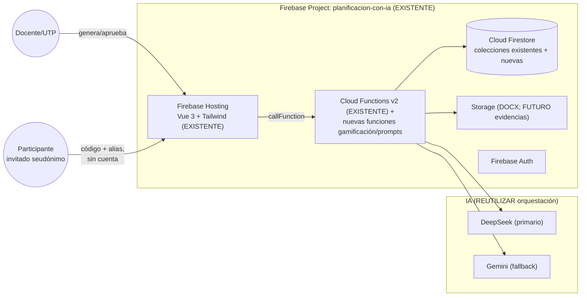

## 35. Reutilización del sistema actual

Cada componente nuevo reutiliza la infraestructura existente; ningún componente existente se duplica ni se reemplaza:

| Componente existente | Clasificación | Uso nuevo |
|---|---|---|
| `generateFromProvider`, `callDeepSeek`, `callGemini` | `REUTILIZAR` | Todas las funciones nuevas de IA (tras extracción a módulo común) |
| `extractJson`, `normalizePlanningOutput` | `REUTILIZAR` | Salidas de recomendaciones/gamificación |
| `sanitizeContextFields`, `detectPromptInjection`, `applyPromptGuard` | `REUTILIZAR` | Cualquier entrada/salida IA nueva |
| `runPedagogicalAudit`, `VALIDATION_RULES` | `REUTILIZAR` + `EXTENDER` | Auditoría de gamificación usa el mismo patrón |
| `evaluateQuality` | `REUTILIZAR` | Score de calidad de gamificaciones (adaptado) |
| `runCoherenceReview` | `REUTILIZAR` | Revisión de coherencia de experiencias |
| `recordBudgetUsage`, `isOverBudget`, `budget-usage` | `REUTILIZAR` | Control de costos de todos los flujos nuevos |
| `ai-costs`, `audit-logs` | `REUTILIZAR` + `EXTENDER` | Nuevos campos `functionType`/`resourceType` |
| `canApprovePlanning`, roles org | `REUTILIZAR` | Aprobación de gamificaciones por UTP |
| `PLANS`, `getUserPlan` | `REUTILIZAR` | Cuotas específicas de los módulos nuevos |
| `prompt-templates` | `REUTILIZAR` + `EXTENDER` | Plantillas para recomendador/gamificación/prompts |
| Wizard/Editor/Detalle | `REUTILIZAR` + `EXTENDER` | Puntos de entrada de las acciones nuevas |
| `core.js` store, Layout, UI helpers | `REUTILIZAR` | Nuevas páginas (gamificaciones, participante) |
| `runRetentionSweep` | `REUTILIZAR` + `EXTENDER` | Retención de las colecciones nuevas |
| `firestore.rules` patrones | `REUTILIZAR` | Nuevos `match` con el mismo estilo |

---

## 36. Modelo de datos (incremental)

`CREAR` — no reemplaza colecciones existentes. Tabla completa (colección/sub · propósito · campos clave · relaciones · índices · reglas · retención · PII · costo · lecturas/escrituras).

| Colección/sub | Propósito | Campos clave | Relaciones | Índices | Reglas | Retención | PII | Costo/impacto |
|---|---|---|---|---|---|---|---|---|
| `methodology-catalog/{code}` | Catálogo de 17 metodologías + `PVISIBLE` | `code,name,legacyKeys,description,prerequisites,minDuration,maxDuration,minSessions,resourceRequired,groupWork,complexity,teacherLoad,studentLoad,gamificationPossible,techDependencies,offlineAlternative,securityConstraints,ageMin,accessibilityNotes,evidenceTypes` | — (documento estático, admin-write) | ninguno | read público; write admin | indefinido (estático) | no | ~20 docs, lectura cacheada 7 días; costo despreciable |
| `resource-profiles/{uid}` | Perfil de recursos declarado por docente | `uid,resources[],internetAccess,techAvailability,updatedAt` | → `users` | `uid` | owner | 90 días tras baja | contexto agregado | 1 doc/usuario |
| `territorial-contexts/{uid}` | Contexto territorial opcional | `uid,region,comuna,zona,actividadesProductivas[],patrimonio,problemasLocales[],medioambiente[],institucionesCercanas[],organizaciones[],culturales[],desafios[]` | → `users`, `plannings.territoryRef` | `uid` | owner | 90 días | agregado, sin nombres | 1 doc/usuario |
| `tp-specialties/{id}` | Catálogo de especialidades TP | `sector,especialidad,mention,modules[],competencies[] (oficial),source` | — | `sector` | read público; write admin | estático | no | catálogo estático |
| `tp-contexts/{uid}` | Contexto TP opcional | `uid,isTp,sector,especialidad,mention,level,module,competenciasTecnicas[],contextoPractica,equipamiento[],riesgosSeguridad[]` | → `users`, `plannings.tpContextRef` | `uid` | owner | 90 días | agregado | 1 doc/usuario |
| `methodology-recommendations/{id}` | Resultado de una recomendación | `uid,planningId?,contextSnapshot,recommendations[1..3],chosen?,status(draft|accepted|rejected|ignored),aiContributions,createdAt` | → `plannings` | `uid+createdAt` | owner | 1 año | contexto agregado | 1 escritura + 1 IA por uso; cacheable |
| `gamified-experiences/{expId}` | Experiencia gamificada (documento raíz) | `title,description,narrative,status(draft|published|paused|archived),authorUid,orgId?,sourcePlanningId?,sourcePlanningVersionId?,sourceActivityId?,sourceType,oa[] (snapshot),skills[],attitudes[],purpose,evidenceCriteria[],aiContributions,version,mode(individual|teams|presentation),code,shortCode,qrUrl,availableFrom,availableTo,createdAt,updatedAt` | → `plannings` (link, no copia semántica) | `authorUid+createdAt`, `orgId+createdAt`, `status` | owner / org-members read; write owner/org-admin | 2 años (o archivo) | narrativa validada sin PII | 1 doc/experiencia |
| `gamified-experiences/{expId}/versions/{v}` | Versionado de experiencia | `version,snapshot,reason,authorUid,createdAt` | → experiencia | `version` | owner/org-admin | 2 años | — | por guardado |
| `gamified-experiences/{expId}/missions/{missionId}` | Misiones | `order,title,instructions,oaRelation?,activityIds[],type,points,unlockConditions[],evidenceRequired,reflectionRequired,availableFrom,availableTo,accessibilityNotes` | → experiencia | `order` | owner/org-admin write; participante read si publicada | con experiencia | — | por misión |
| `gamified-experiences/{expId}/rules/{ruleId}` | Reglas `EVENTO→CONDICIÓN→ACCIÓN` | `event,conditions[],action,actionValue,priority` | → experiencia | `event` | owner/org-admin | con experiencia | — | por experiencia |
| `gamified-experiences/{expId}/participants/{token}` | Participantes | `alias,teamAlias?,mode,joinedAt,lastActiveAt,status(active|paused),deviceToken?` | → experiencia | `alias`, `status` | **nadie cliente**: solo Functions (join/submit) | 30 días tras cierre | seudónimo, sin correo/nombre | por sesión; alta tasa → usar agregados |
| `gamified-experiences/{expId}/participants/{token}/progress` (embebido) | Progreso por participante | `points,missionsCompleted[],badges[],level,pctComplete,updatedAt` | → participante | — (embebido) | solo Functions | 30 días | seudónimo | 1 escritura por evento |
| `gamified-experiences/{expId}/evidence/{evId}` | Entregas | `participantToken,missionId,text,links[],fileUrl?,status(pending|approved|rejected),reviewerUid?,reviewComment?,createdAt,reviewedAt` | → misión, participante | `missionId+status` | solo Functions (submit/review) | 90 días | texto validado PII | por entrega |
| `gamified-experiences/{expId}/feedback/{fbId}` | Retroalimentación automática/docente | `participantToken?,missionId?,type(auto|teacher),text,createdAt` | → misión | `missionId` | solo Functions | 90 días | — | por evento |
| `badges/{badgeId}` | Catálogo de insignias | `code,name,description,iconId,condition,rules`, `active` | — | `active` | read público; write admin | estático | no | catálogo |
| `badge-awards/{awardId}` | Entrega de insignia (idempotente) | `experienceId,participantToken,badgeCode,earnedAt,sourceEvent,uniqueKey` | → participante, badge | `uniqueKey` (único) | solo Functions | 1 año | seudónimo | por entrega |
| `external-tool-profiles/{tool}` | Perfil verificado por herramienta | `tool,name,acceptsPrompts(bool),inputFormats[],outputFormats[],limits[],accessibilityNotes[],verificationDate,verifiedUrl,active` | — | `active` | read público; write admin | estático | no | catálogo |
| `external-prompts/{id}` | Prompt generado | `uid,planningId?,tool,toolProfileVersion,resourceType,package,exports[],aiContributions,createdAt` | → `plannings`, `external-tool-profiles` | `uid+createdAt`, `tool` | owner | 1 año | contexto agregado | 1 IA + 1 escritura por uso |
| `gamification-costs/{id}` | Costo IA de gamificación (visión específica) | `expId?,functionType,provider,model,tokensIn,tokensOut,cost,date,uid,orgId,result` | → `ai-costs` | `date`, `expId` | solo Functions | 2 años | — | 1 escritura por llamada IA |
| `gamification-audit-logs/{id}` | Auditoría de eventos de experiencia | `expId,participantToken?,action,data,createdAt,uid?` | → experiencia | `expId+createdAt`, `action` | solo Functions | 1 año | seudónimo | 1 escritura por evento crítico |

**Criterio de diseño** (`REQUERIMIENTO TÉCNICO`): `participants/progress` y eventos de alta frecuencia usan **documentos embebidos** o agregados denormados para evitar exceso de lecturas; los catálogos (`methodology-catalog`, `badges`, `tp-specialties`, `external-tool-profiles`) son **estáticos y cacheables** (localStorage TTL 7 días, patrón existente del catálogo de asignaturas).

---

## 37. Cloud Functions conceptuales

`CREAR` — ninguna implementada todavía. Todas siguen el patrón actual (`onCall` v2 con `cors` restringido, auth obligatoria, validación, PII, prompt-injection, costos, auditoría).

| Función | Autenticación/Autorización | Entrada → Salida | Colecciones | IA / costo | Auditoría | Errores | Riesgos |
|---|---|---|---|---|---|---|---|
| `recommendMethodologies` | Auth; owner (planning propia si aplica) | `{context ampliado, oaIds, planningId?}` → `{recommendations[1..3], status}` | `methodology-recommendations`, `methodology-catalog`, `curriculum` | 1 llamada IA explicativa | `recommend_methodology` | `CONTEXTO_INCOMPLETO`, `CATALOGO_INACTIVO` | Costo extra; alucinación → limitada por reglas deterministas |
| `generateActivityVariants` | Auth; owner | `{planningId, activityId, resources}` → `{variants A/B/C/D}` | `plannings`, `resource-profiles` | 1 IA | `generate_variants` | `ACTIVIDAD_NO_ENCONTRADA`, `RECURSOS_INCOMPATIBLES` | Variantes con recursos no declarados → regla de corte |
| `createGamifiedExperience` | Auth; owner | `{sourceRef, mode, options}` → `{experienceId}` (borrador) | `gamified-experiences`, `plannings` | 0 (estructura) o 1 IA (draft) | `gamify_create` | `FUENTE_NO_ENCONTRADA`, `FLAG_DESACTIVADO` | Sobrescritura de fuente → prohibido por diseño |
| `generateGamificationDraft` | Auth; owner | `{experienceId}` → `{draft}` | experiencia | 1 IA | `gamify_draft` | `STATUS_INVALIDO` | Narrativa con PII → sanitización |
| `regenerateGamificationSection` | Auth; owner | `{experienceId, section, instruction}` → `{content}` (whitelist de secciones) | experiencia | 1 IA | `gamify_regenerate` | `SECCION_INVALIDA` | Aplica misma protección que B1 |
| `validateGamifiedExperience` | Auth; owner | `{experienceId}` → `{review}` (críticos/advertencias/sugerencias/info) | experiencia, `experience-rules` | reglas puras (+PT-007 opcional) | `gamify_validate` | `REGLA_CIRCULAR`, `MISION_INACCESIBLE` | Falsos positivos → reglas puras y testeables |
| `publishGamifiedExperience` | Auth; owner/org-admin (aprobación UTP cuando `orgId`) | `{experienceId}` → `{code, shortCode, qrUrl, url}` | experiencia | 0 | `gamify_publish` | `VALIDACION_PENDIENTE` (si revisión no aprobada) | Códigos enumerables → aleatoriedad (sección 39) |
| `unpublishGamifiedExperience` | Auth; owner/org-admin | `{experienceId}` → `{status}` | experiencia | 0 | `gamify_unpublish` | — | — |
| `archiveGamifiedExperience` | Auth; owner/org-admin | `{experienceId}` → `{status}` | experiencia | 0 | `gamify_archive` | — | Datos → retención |
| `joinGamifiedExperience` | Auth anónimo/visitante (firestore rules) | `{code, alias}` → `{participantToken}` | participantes | 0 | `gamify_join` | `CODIGO_INVALIDO`, `EXPERIENCIA_CERRADA`, `ALIAS_OCUPADO` | Suplantación → token aleatorio; rate limit |
| `submitMissionEvidence` | Participante (token) | `{participantToken, missionId, evidence}` → `{status}` | `experience-evidence` | 0 | `gamify_evidence_submit` | `MISION_INACCESIBLE` | Evidencia maliciosa → validación tipo, tamaño, PII |
| `reviewMissionEvidence` | Auth; owner/org-admin | `{evidenceId, approve, comment}` → `{status}` | evidencia, reglas | 0 | `gamify_evidence_review` | `EVIDENCIA_YA_REVISADA` | Doble revisión → idempotencia |
| `calculateExperienceProgress` | Auth; owner | `{experienceId}` → agregados | participantes/progress | 0 (funciones puras) | — | — | Costo de lectura → agregados denormados |
| `awardInternalBadge` | Functions internal (no expuesta) | `{participantToken, badgeCode, sourceEvent}` → `{awardId}` | `badge-awards`, reglas | 0 | `gamify_badge` | `BADGE_DUPLICADO` | Doble entrega → `uniqueKey` único |
| `generateExternalToolPrompt` | Auth; owner | `{planningId?, tool, resourceType, context}` → `{package}` | `external-prompts`, `external-tool-profiles` | 1 IA | `prompt_generate` | `HERRAMIENTA_NO_VERIFICADA` | Prompt incompatible → perfil limita tipos |
| `exportExternalPromptPackage` | Auth; owner | `{promptId, format}` → `{content|downloadUrl}` | `external-prompts` | 0 | `prompt_export` | `FORMATO_INVALIDO` | — |
| `syncPlanningContext` | Auth; owner | `{experienceId}` → `{diff, suggestions}` | experiencia, `plannings` | 0 | `gamify_sync` | — | Sincronización automática → solo selectiva, nunca overwrite |

**Reglas comunes** (`REQUERIMIENTO TÉCNICO`): `cors` restringido a `https://planificacion-con-ia.web.app`; auth obligatoria (excepto `joinGamifiedExperience`); rate limit propio por `uid` (Firestore no ofrece rate limit nativo en callables — verificado en 2026-08-06); error wrapper a `HttpsError`; auditoría en `gamification-audit-logs` + `audit-logs`; costos en `ai-costs` + `gamification-costs` + `budget-usage`.

---

## 38. Reglas Firestore

`EXTENDER` `firestore.rules` con bloques nuevos (los existentes se mantienen intactos):

```js
// ========== Catálogos nuevos: lectura pública, escritura admin ==========
match /methodology-catalog/{code} { allow read: if true; allow write: if isAdmin(); }
match /badges/{badgeId} { allow read: if true; allow write: if isAdmin(); }
match /tp-specialties/{id} { allow read: if true; allow write: if isAdmin(); }
match /external-tool-profiles/{tool} { allow read: if true; allow write: if isAdmin(); }

// ========== Contextos opcionales: propietario ==========
match /resource-profiles/{uid} { allow read, write: if isOwner(uid); }
match /territorial-contexts/{uid} { allow read, write: if isOwner(uid); }
match /tp-contexts/{uid} { allow read, write: if isOwner(uid); }

// ========== Recomendaciones y prompts externos: propietario ==========
match /methodology-recommendations/{id} {
  allow read, write: if isOwner(resource.data.uid);
}
match /external-prompts/{id} {
  allow read, write: if isOwner(resource.data.uid);
}

// ========== Experiencias gamificadas: propietario / org (reusa canReadPlanning) ==========
match /gamified-experiences/{expId} {
  allow read: if canReadPlanning(resource.data);   // owner, admin o miembro de org
  allow create: if isAuthenticated() && request.resource.data.authorUid == request.auth.uid;
  allow update, delete: if isOwner(resource.data.authorUid) || isAdmin()
    || isOrgAdmin(resource.data.orgId);
  match /versions/{v} { allow read, write: if isOwner(get(...).data.authorUid) || isAdmin() || isOrgAdmin(...); }
  match /missions/{m} { allow read: if canReadPlanning(get(...).data); allow write: if isOwner(...) || isAdmin() || isOrgAdmin(...); }
  match /rules/{r} { allow read: if canReadPlanning(get(...).data); allow write: if isOwner(...) || isAdmin() || isOrgAdmin(...); }
  // Participantes, progreso, evidencia, feedback: SOLO Cloud Functions
  match /participants/{token} { allow read, write: if false; }
  match /evidence/{e} { allow read, write: if false; }
  match /feedback/{f} { allow read, write: if false; }
}

match /badge-awards/{awardId} { allow read: if isAdmin(); allow write: if false; }
match /gamification-costs/{id} { allow read: if isAdmin(); allow write: if false; }
match /gamification-audit-logs/{id} { allow read: if isAdmin(); allow write: if false; }
```

`REQUERIMIENTO TÉCNICO`: el acceso de **participantes** (invitados seudónimos sin cuenta) NO pasa por Security Rules directo: pasa por Cloud Functions (`joinGamifiedExperience`, `submitMissionEvidence`, etc.) que validan el token. La colección `participants`/`progress`/`evidence` permanece `write: false` para clientes. **Índices** nuevos (sección 36): `methodology-recommendations(uid+createdAt)`, `external-prompts(uid+createdAt)`, `gamified-experiences(authorUid+createdAt)`, `gamified-experiences(orgId+createdAt)`, `experience-evidence(missionId+status)`, `badge-awards(uniqueKey)`, `gamification-audit-logs(expId+createdAt)`. Nota: los `match` con `get(...)` requieren reglas cuidadosas por costo de lecturas de reglas; alternativamente el acceso a subcolecciones se resuelve solo por Functions.

---

## 39. Seguridad

`REQUERIMIENTO TÉCNICO` — amenazas y mitigaciones (base OWASP LLM/GenAI, sección 56):

| Amenaza | Mitigación |
|---|---|
| Acceso no autorizado a experiencias | Códigos aleatorios (≥8 chars, alfabeto amplio); `participants` solo Functions |
| Códigos enumerables | Generación criptográfica (`crypto.randomBytes`), sin IDs internos; estado + expiración; revocación |
| Enlaces compartidos | `shortCode` revocable; `unpublish` invalida acceso; logging de uso |
| Suplantación de participantes | Token de sesión firmado/aleatorio; alias único por experiencia; rate limit por IP |
| Manipulación de puntajes | Progreso solo Functions; eventos idempotentes; `calculateExperienceProgress` puro |
| Repetición de eventos | `uniqueKey` en eventos y `badge-awards`; transacciones |
| Doble asignación de insignias | `uniqueKey` único + validación del motor de reglas |
| Evidencia maliciosa | Validación de tipo/tamaño (imagen/PDF ≤2 MB), sanitización de texto, sin HTML renderizado |
| XSS | Salida de IA siempre escapada; `v-html` prohibido para contenido de modelo (`REQUERIMIENTO TÉCNICO`) |
| Enlaces externos | Lista blanca de protocolos (`https://`), `rel="noopener noreferrer"`, aviso de salida |
| Prompt injection | Reuso de `detectPromptInjection` + `PROMPT_GUARD` en todas las entradas nuevas |
| Contenido generado inseguro | Validación de salida contra schemas (sección 42); `hasPII`; revisión docente |
| Exposición de menores | Sin correo/nombre completo; modo invitado seudónimo; retención corta (30 días) |
| Datos personales en narrativas | Sanitización PII en generación y en entregas |
| Filtración de prompts | `prompt-templates` solo admin; sin secretos en prompts (LLM07) |
| Abuso de generación / costos | Rate limit propio por `uid`; límites por plan; kill-switch; App Check (recomendado) |
| Reglas de Firestore | Pruebas con emulador; patrón existente de `integration.test.js` |

---

## 40. Privacidad

- Portal de participante: **seudónimos obligatorios**, sin correo, sin datos individualizados (diseño PR004).
- Retención: `participants`/`progress` 30 días tras cierre; `evidence`/`feedback` 90 días; `badge-awards` 1 año; `methodology-recommendations`/`external-prompts` 1 año; `gamified-experiences` + versiones 2 años (o archivado manual). `runRetentionSweep` se amplía (`EXTENDER`) con las nuevas colecciones.
- `REQUERIMIENTO LEGAL`: adecuación a Ley 21.719 (vigencia 01/12/2026) con consentimiento cuando aplique; revisión jurídica H01 vigente; `POR VALIDAR` el detalle de menores/consentimiento parental en la nueva ley.
- Datos de estudiantes: solo alias, agregados y evidencias curriculares autorizadas; nunca en prompts IA.

---

## 41. Accesibilidad (WCAG 2.2 AA)

Mantener el gate axe-core existente y ampliarlo a los flujos nuevos:

- Navegación por teclado; foco visible (2.4.7) y no oculto (2.4.11); alternativas al arrastre (2.5.7); targets ≥24×24 px (2.5.8).
- Reducción de movimiento (2.3.3 + `prefers-reduced-motion`); temporizadores ajustables (2.2.1) en retos/quiz.
- Narrativas en texto; insignias con `aria-label`/descripción; contraste 4.5:1 (1.4.3); no depender del color (1.4.1).
- QR acompañado de enlace + código textual (alternativa no textual, 1.1.1); autenticación sin test cognitivo (3.3.8).
- Sonidos opcionales, subtítulos, vista de alto contraste, modo sin animaciones, portal responsive.
- Toda actividad nativa ofrece **alternativa no digital o simplificada**.
- `FUTURO`: auditoría manual con lectores de pantalla (NVDA/VoiceOver) en el portal participante.

---

## 42. IA

- Reutilizar la orquestación existente; **extraer primero** la lógica común a módulos reutilizables (B12) antes de añadir funciones.
- No duplicar: proveedor, fallback, extracción JSON, costos, PII, prompt-injection, auditoría, rúbrica, coherencia.
- Modelos: primario DeepSeek; migrar alias si `deepseek-chat` deja de existir (V-02, `POR VALIDAR`); fallback Gemini `gemini-2.5-flash` con `responseSchema` (V-03).
- Salidas nuevas estructuradas y validadas contra schemas:

| Schema | Uso |
|---|---|
| `MethodologyRecommendationSchema` | Sección 14.2 |
| `ActivityVariantSchema` | Sección 17 |
| `GamifiedExperienceSchema` | Experiencia completa |
| `MissionSchema` | Misiones |
| `RuleSchema` | Motor de reglas |
| `ExternalToolPromptSchema` | Sección 23.1 |
| `GamificationAuditSchema` | Auditoría de experiencias |

`REQUERIMIENTO TÉCNICO`: no renderizar HTML directo del modelo; todo el contenido de la IA se trata como datos (escapado).

---

## 43. Costos

`EXTENDER` el sistema existente. Toda llamada IA nueva registra: `userId`, `orgId`, `functionType`, `provider`, `model`, `tokens`, `cost`, `duration`, `result`, `fallback`, `planningId?`, `experienceId?`, `tool?`, `date`.

**Tipos de costo diferenciados:** `planificacion` · `recomendacion_metodologica` · `gamificacion` · `regeneracion` · `prompt_externo` · `revision_coherencia`.

Todos usan: presupuesto mensual (`budget-usage`), kill-switch al 80%, límites por plan, contador atómico (B3), alertas y trazabilidad.

**Cuotas propuestas (no aplicadas todavía; por plan):**

| Módulo | Free | Pro | Unidad |
|---|---|---|---|
| Recomendaciones metodológicas | 10/día | 200/día | llamadas |
| Variantes de actividad | 10/día | 200/día | llamadas |
| Gamificación (draft + regeneraciones) | 5/día | 100/día | llamadas |
| Prompts externos | 5/día | 100/día | llamadas |
| Revisión de coherencia (PT-007) | incluida en generación | incluida | llamadas |

**Estimación de costo incremental:** recomendación ~1.200 tokens in/400 out ≈ $0.00022 (DeepSeek v4-flash); draft de gamificación ~2.000 in/800 out ≈ $0.00048; prompt externo ~1.500 in/500 out ≈ $0.00029. Con cuotas free, el costo marginal por docente activo es <$0.01/día; verificado contra `MONTHLY_BUDGET_USD`. `POR VALIDAR` el aumento de precios DeepSeek anunciado (V-02).

---

## 44. UX

### 43.1 Navegación principal (extensión)

Planificaciones · **Gamificaciones** · Biblioteca · Institucional · Perfil · Ayuda.

### 43.2 Dentro de una planificación

Editar · **Regenerar sección** (B8) · **Revisar calidad** (B9) · Exportar · **Crear actividad** · **Gamificar** · **Generar recurso externo**.

### 43.3 Dashboard de gamificaciones

Borradores · Publicadas · Pausadas · Archivadas · Participantes · Progreso · Prompts externos · Plantillas.

### 43.4 Flujo de creación de una experiencia

1. Seleccionar planificación (o comenzar desde cero) → 2. Elegir actividad → 3. Modalidad nativa/externa → 4. Participantes y recursos → 5. Estructura → 6. Generar → 7. Revisar → 8. Probar → 9. Aprobar → 10. Publicar o exportar.

`REQUERIMIENTO TÉCNICO`: el paso de recomendación **nunca bloquea** el flujo actual; es una sección colapsable con “Omitir”.

---

## 45. Diagramas Mermaid

### 45.1 Arquitectura actual y extensión (sección 34.1)

Ver diagrama en la sección 34.1.

### 45.2 Planificación → recomendación metodológica

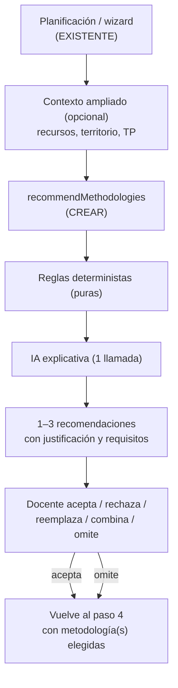

### 45.3 Planificación → gamificación

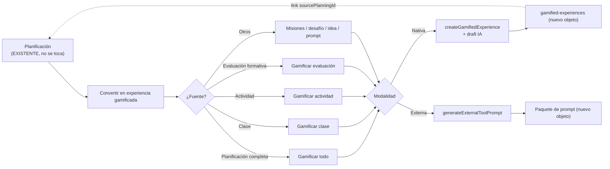

### 45.4 Modalidad nativa (flujo de creación)

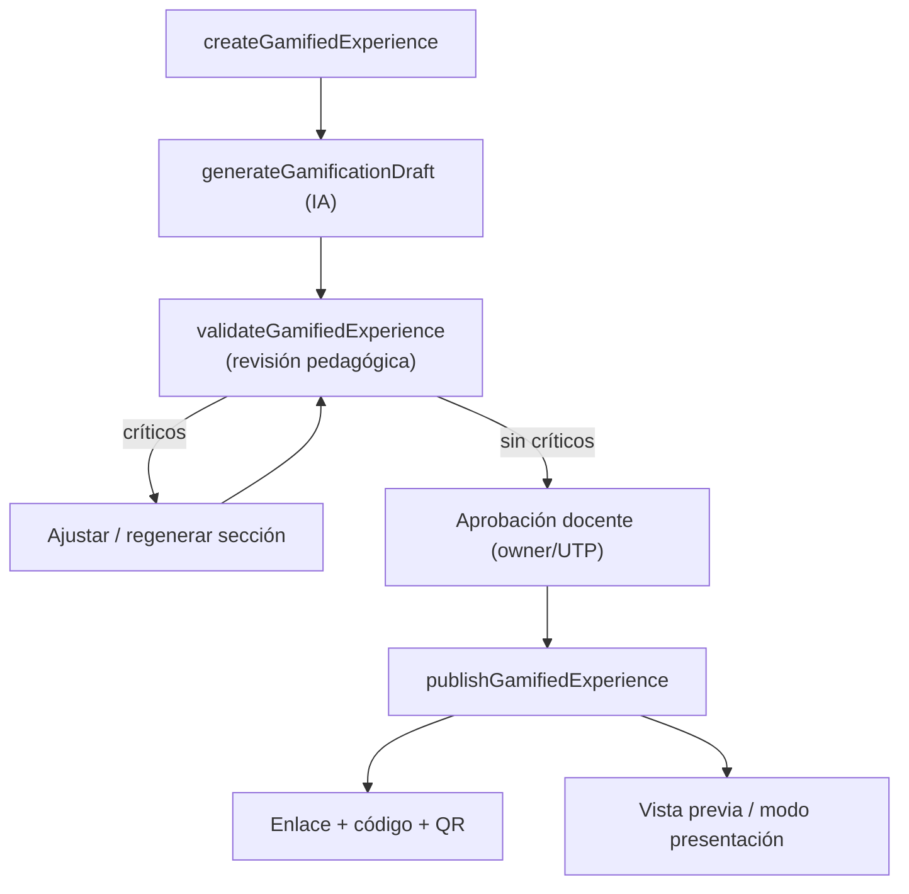

### 45.5 Modalidad externa (flujo)

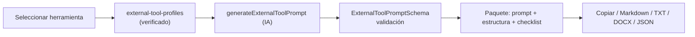

### 45.6 Publicación

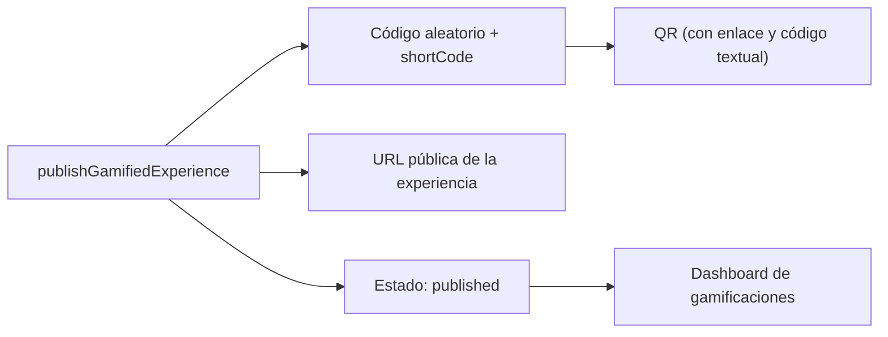

### 45.7 Acceso del participante

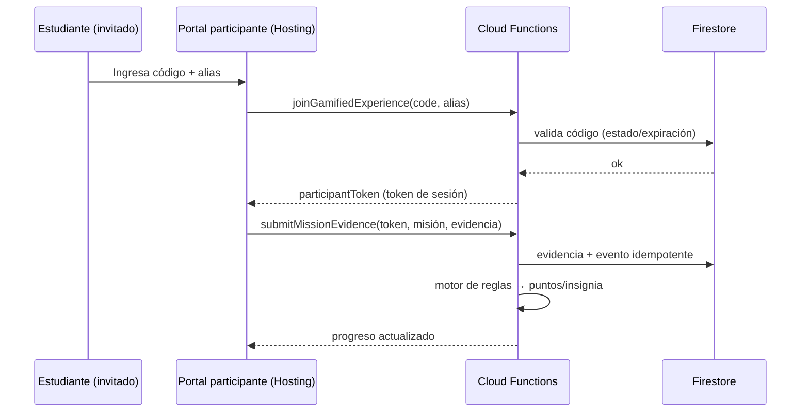

### 45.8 Misión y progreso

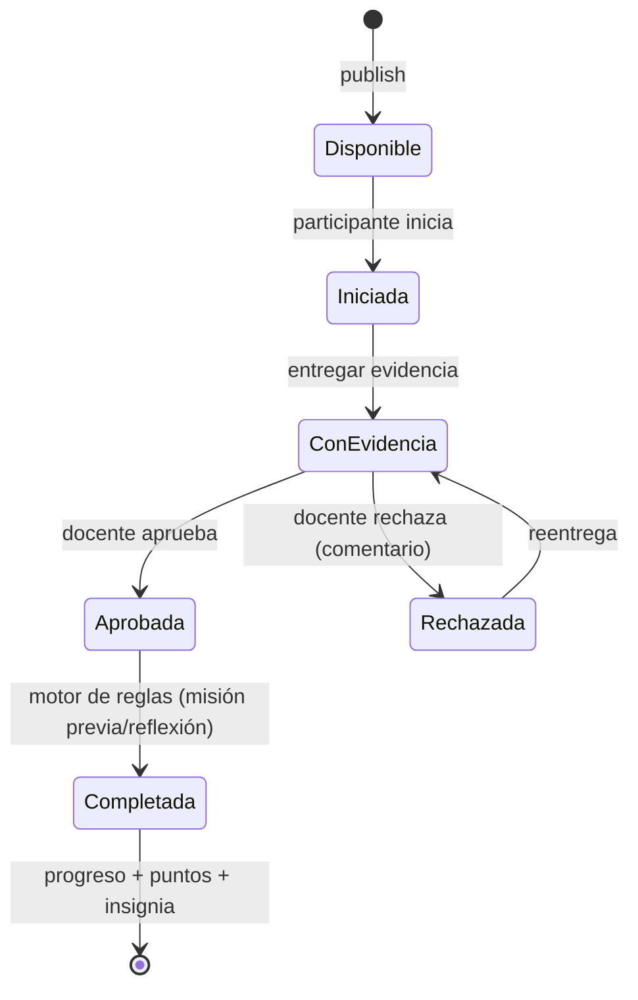

### 45.9 Motor de reglas

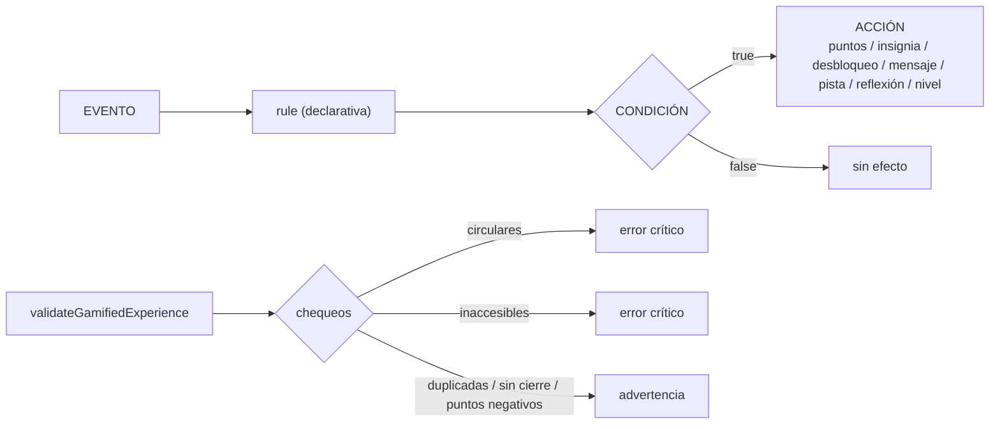

### 45.10 Costos

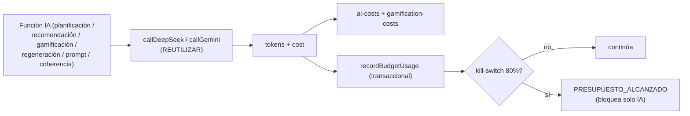

### 45.11 Versionado

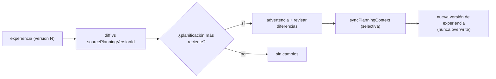

### 45.12 Feature flags

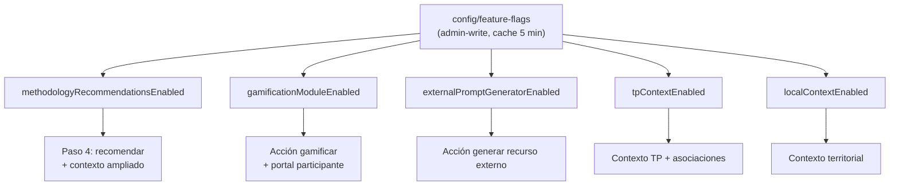

### 45.13 Despliegue gradual

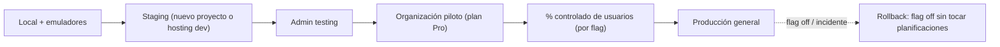

---

## 46. Estrategia de pruebas

`EXTENDER` la estrategia existente (unit Jest 106, E2E Playwright, dataset eval, axe-core).

| Tipo | Contenido nuevo |
|---|---|
| Unitarias | Reglas del motor (compatibilidad recursos, duración, sesiones, TP/seguridad, clasificación complejidad), validadores de schemas, motor de reglas (eventos/condiciones/acciones, circulares, inaccesibles, duplicadas), puntos/insignias/progreso (funciones puras), prompts por herramienta (estructura y campos obligatorios), costos, `uniqueKey`/idempotencia |
| Integración | Planificación→gamificación (link + versionado), planificación→prompt externo, sincronización de OA, publicación/despublicación, acceso por código, evidencia→revisión→insignia, Firestore Rules (patrón `integration.test.js` con emulador) |
| E2E | Crear planificación → recibir recomendación → escoger ABPROY → variante sin tecnología → gamificar actividad → publicar → entrar como participante → completar misión → revisar evidencia → insignia → prompt Genially → copiar prompt |
| Seguridad | Código enumerado (fuerza bruta), usuario ajeno, modificación de puntos (rechazada), doble evento, prompt injection, XSS (sin `v-html`), PII, sobrecosto (kill-switch), abuso de rate limit |
| Accesibilidad | Teclado, lector de pantalla (manual), reducción de movimiento, temporizadores, formularios, QR alternativo, portal participante; axe-core ampliado a las rutas nuevas |

`REQUERIMIENTO TÉCNICO`: los tests de la lógica nueva deben **importar** la lógica pura extraída (B12), no duplicarla; los helpers ya no se espejan.

---

## 47. Plan por fases (U0–U17)

Para cada fase: objetivo, alcance, archivos/colecciones/funciones/interfaces afectadas, dependencias, pruebas, riesgos, costo, entregables, criterios de aceptación, rollback y condición para avanzar.

### Fase U0 — Auditoría y estabilización (`CORREGIR ANTES`)
- **Objetivo:** resolver B1–B12.
- **Archivos:** `functions/index.js`, `functions/index.test.js`, `functions/logic.js` (nuevo), `public/js/pages/{detail,editor,wizard}.js`.
- **Pruebas:** unit + E2E existentes en verde; nuevos tests de B1/B3/B8/B9/B10/B11.
- **Riesgos:** alto (afecta core).
- **Criterios de aceptación:** B1–B12 cerrados según la tabla de la sección 7; CI/Deploy verdes; **condición para avanzar**: ninguna función nueva de IA hasta cumplir B1–B7.
- **Rollback:** revertir commit de estabilización.
- **Costo:** 0 IA.

**Cierre (2026-08-07):** B1–B12 resueltos en `main`.
- **B1–B7 (backend):** whitelist `ALLOWED_REGENERABLE` + `isRegenerableSection`; retirado `rateLimiting` no soportado de `onCall` (v2); límite diario atómico con `reserveDailyAllowance`/`releaseDailyAllowance` sobre `usage/{userId}__{YYYY-MM-DD}` (B2/B3); `regenerateSection` y `runCoherenceReview` registran `ai-costs` + `budget-usage` (B4/B5); Gemini sin fallback de web key + `gemini-2.5-flash` (B6); DeepSeek migrado a `deepseek-v4-flash` (B7, `deepseek-chat` retirado el 2026-07-24).
- **B8–B11 (frontend):** regeneración por sección con aceptar/rechazar en `detail.js`; card de "Calidad y coherencia"; `<select>` del paso 6 del wizard con binding y payload; `snap.exists()` como método.
- **B12 (arquitectura):** nueva `functions/logic.js` con la lógica pura (49 exports) importable sin `initializeApp()`; `index.js` importa y re-exporta desde ella; `index.test.js` y `scripts/eval-batch.mjs` importan desde `logic.js` (eliminados los espejos obsoletos, incluida la réplica recortada de reglas en `eval-batch.mjs`).
- **Verificación:** `pnpm --dir functions test:unit` 109/109; `node --check` en `index.js`, `index.test.js`, `logic.js` y `eval-batch.mjs`; smoke test de carga de `index.js` con firebase mockeado (19 exports OK); `node scripts/eval-batch.mjs` ejecuta y genera reporte. Pendiente para CI/E2E: `frontend.test.py` (producción) y validación real en staging de los costos/fallback de IA (B6/B7).

### Fase U1 — Diseño funcional incremental
- Definir contratos de datos y APIs; aprobar feature flags y esquemas (sección 42). Sin código IA.
- **Entregable:** este plan aprobado + ADR de decisiones.

### Fase U2 — Catálogo metodológico
- `methodology-catalog` (17 + `PVISIBLE`), seed idempotente, campos `legacyKeys`, mapeo V-013.
- **Pruebas:** catálogo + mapeo + compatibilidad con `METHODOLOGY_KEYWORDS`.

**Cierre (2026-08-10):** catálogo implementado con código puro en `functions/logic.js`.
- **`METHODOLOGY_CATALOG`:** 17 códigos estables + `PVISIBLE`, con todos los campos de la sección 36 (`legacyKeys`, `description`, `prerequisites`, `minDuration`, `maxDuration`, `minSessions`, `resourceRequired`, `groupWork`, `complexity`, `teacherLoad`, `studentLoad`, `gamificationPossible`, `techDependencies`, `offlineAlternative`, `securityConstraints`, `ageMin`, `accessibilityNotes`, `evidenceTypes`).
- **Resolución:** `resolveMethodologyCode` mapea valores legacy (`abp` → `ABPROY`/`ABPROB`, `dialogada` → `DIRECTA`, `cooperativo` → `ACOOP`, `gamificacion` → `GAM`, `indagacion` → `IND`, `pensamiento-visible` → `PVISIBLE`) y nombres exactos a códigos del catálogo; `resolveMethodologyFamily` asocia cada código a su familia de keywords.
- **V-013 extendido:** valida coherencia con códigos nuevos vía `resolveMethodologyFamily` (sin romper tests legacy). `MIXTA` se excluye de la verificación (combinación justificada por el docente); `PVISIBLE` se conserva como etiqueta auxiliar.
- **Seed:** `scripts/seed-methodology-catalog.mjs` idempotente (docs deterministas `methodology-catalog/{code}`), reutiliza `METHODOLOGY_CATALOG` de `logic.js` como fuente única.
- **Verificación:** `pnpm --dir functions test:unit` 116/116 (7 tests nuevos de U2); `node --check` en `logic.js`, `index.test.js` y el seed; `eval-batch.mjs` sin errores. Pendiente: ejecutar el seed contra producción (requiere `FIREBASE_SA_PATH`).

### Fase U3 — Contexto ampliado
- Campos opcionales del paso 3; `resource-profiles`, `territorial-contexts`, `tp-contexts`; UI colapsable. Flags `tpContextEnabled`/`localContextEnabled`/`methodologyRecommendationsEnabled`.

**Cierre (2026-08-10):** contexto ampliado implementado con lógica pura en `functions/logic.js`.
- **Enums y checklist (secciones 15–16):** `TECH_AVAILABILITY_LEVELS`, `INTERNET_ACCESS_LEVELS`, `GROUP_EXPERIENCE_LEVELS`, `STUDENT_AUTONOMY_LEVELS`, `DIGITAL_COMPETENCE_LEVELS`, `ZONA_LEVELS` y `PHYSICAL_RESOURCES_CHECKLIST` (19 items) exportadas desde `logic.js`.
- **Feature flags:** `FEATURE_FLAGS` (por defecto apagadas) + `resolveFeatureFlags`. En `index.js`, `getFeatureFlags()` lee `config/feature-flags` con caché de 5 min y override por env (`FLAG_*`). Con las flags apagadas el wizard se comporta igual que hoy.
- **Normalización:** `normalizeTerritory`, `normalizeTpContext` (sanitización PII campo a campo) y `normalizeContextExtension(context, flags)` que captura solo los campos habilitados, valida enums y devuelve `{ extension, errors }`.
- **Prompt:** `buildContextExtensionText(extension)` genera texto plano de datos ("Contexto ampliado del grupo") añadido al userPrompt cuando hay extensión; `sanitizeContextFields` acepta `barriers` como string (legacy) o array.
- **Persistencia:** `buildPlanningRecord` guarda `contextExtension` (snapshot) y `index.js` hace upsert del perfil en `resource-profiles/{uid}`.
- **Firestore rules:** `methodology-catalog` (U2), `config/feature-flags` (read público), `resource-profiles`, `territorial-contexts`, `tp-contexts` (owner), `tp-specialties` (read público/admin-write).
- **Frontend (wizard paso 3):** secciones colapsables "Más contexto (opcional)", "Contexto territorial" y "Contexto técnico-profesional" renderizadas solo con `methodologyRecommendationsEnabled`/`localContextEnabled`/`tpContextEnabled` (flags leídas con caché de 5 min).
- **Hidden de la fase:** U2 pendiente de seed contra producción; `config/feature-flags` y `tp-specialties` pendientes de seed.
- **Verificación:** `pnpm --dir functions test:unit` 128/128 (12 tests nuevos de U3); `node --check` en `logic.js`, `index.js`, `index.test.js` y `wizard.js`.

### Fase U4 — Recomendador metodológico
- `recommendMethodologies` (reglas puras + IA), UI paso 4, `methodology-recommendations`, aprobación docente. **Pruebas:** reglas, schemas, E2E de flujo.

**Cierre (2026-08-10):** recomendador metodológico implementado con arquitectura híbrida (reglas puras + IA explicativa).
- **Reglas deterministas (META-02):** `PERTINENCE`, `levelToApproxAge`, `contextSessionCount`, `evaluateMethodologyCandidate` y `recommendMethodologies` en `functions/logic.js`. Evalúan sesiones, duración, recursos, tecnología, internet, trabajo grupal, autonomía, edad mínima, socio comunitario para APS y riesgos TP; excluyen `MIXTA` y `PVISIBLE` del método primario.
- **Función U4 (META-03):** callable `recommendMethodologies` en `functions/index.js`; valida autenticación, flag, contexto y propiedad de planificación; recupera OA, ejecuta primero las reglas, solicita a la IA solo explicación/contextualización, valida la estructura 14.2, fuerza `method`/`pertinence` desde las reglas, registra `methodology-recommendations`, `ai-costs`, `budget-usage` y `audit-logs`, y devuelve fallback determinista si la explicación IA no es válida.
- **Schema:** `validateRecommendationOutput` valida 1–3 recomendaciones con los campos de la sección 14.2; `buildRecommendationPrompt` prohíbe porcentajes inventados, invenciones territoriales y cambios de candidatos.
- **Frontend (META-04):** `recommendMethodologiesFn` exportada por `core.js`; el paso 4 muestra botón no bloqueante, tarjetas con etiqueta de pertinencia, riesgos y acción "Usar esta metodología" cuando `methodologyRecommendationsEnabled` está activa. El docente puede continuar sin recomendación.
- **Persistencia y seguridad:** reglas owner para `methodology-recommendations`; retención de un año incorporada a `RETENTION_POLICY`.
- **Verificación:** `pnpm --dir functions test:unit` 141/141; `node --check` en `logic.js`, `index.js`, `index.test.js`, `core.js` y `wizard.js`.

### Fase U5 — Variantes de actividades
- `generateActivityVariants` (A/B/C/D), regla de recursos, UI.

**Cierre (2026-08-10):** variantes de actividades implementadas con corte determinista de recursos.
- **Reglas puras (REC-02):** `normalizeDeclaredResources`, `isResourceAvailable`, `unavailableVariantResources`, `filterActivityVariantsByResources`, `buildOfflineActivityVariant` y `validateActivityVariants` en `functions/logic.js`.
- **Variante A obligatoria:** siempre se construye una alternativa sin multimedia basada en pizarra, papel, tarjetas, objetos y organizadores; no depende de internet ni dispositivos.
- **Callable:** `generateActivityVariants` valida autenticación/propiedad, localiza la actividad, usa el perfil de recursos como fallback, solicita B/C/D a la IA, filtra cualquier recurso no declarado, registra `ai-costs`/`budget-usage`/`audit-logs` y nunca modifica la planificación fuente.
- **Prompt/schema:** `buildActivityVariantsPrompt` trata la actividad como datos; `validateActivityVariants` limita a 1–4 variantes y exige A.
- **Frontend:** `generateActivityVariantsFn` exportada por `core.js`; el detalle muestra acción por actividad y las variantes recibidas.
- **Verificación:** `pnpm --dir functions test:unit` 146/146; `node --check` en `logic.js`, `index.js`, `index.test.js`, `core.js` y `detail.js`.

### Fase U6 — Modelo de gamificación
- Colecciones de la sección 36 + schemas + `validateGamifiedExperience` (motor de reglas).

**Cierre (2026-08-10):** modelo de gamificación y verificador puro implementados.
- **Schemas y normalización:** enums estables para estado, modo, origen, tipos de misión y eventos; `normalizeMission`, `normalizeExperienceRule` y `normalizeGamifiedExperience` sanitizan contenido y aplican defaults seguros.
- **Motor de reglas:** `validateGamifiedExperience` detecta campos pedagógicos faltantes, misiones duplicadas/incompletas, puntos negativos, dependencias inaccesibles, ciclos de desbloqueo, reglas duplicadas/eventos inválidos y condiciones de progreso insuficientes.
- **Reglas Firestore:** experiencia raíz con acceso owner/org, versiones/misiones/reglas protegidas, participantes/evidencias/feedback/costos/auditoría solo por Functions y catálogo `badges` público/admin.
- **Retención:** experiencias y costos de gamificación a 2 años; auditoría a 1 año.
- **Verificación:** `pnpm --dir functions test:unit` 151/151; `node --check` en `logic.js` e `index.test.js`.

### Fase U7 — Constructor de gamificaciones
- `createGamifiedExperience`, `generateGamificationDraft`, `regenerateGamificationSection` (whitelist), editor de experiencia. Flag `gamificationModuleEnabled`.

**Cierre (2026-08-10):** constructor nativo de experiencias gamificadas implementado.
- **Callables (0/1 IA, sin sobrescribir la fuente):** `createGamifiedExperience` (extrae contexto OA/propósito/criterios según `sourceType` y crea `gamified-experiences` draft con nivel `estructure` o `draft`), `generateGamificationDraft` (borrador IA validado contra el schema, persiste misión/rules/narrativa y versiona), `regenerateGamificationSection` (whitelist `ALLOWED_GAMIFICATION_SECTIONS` + protección B1: jamás metadatos/estado; error `SECCION_INVALIDA`). Todos con flag `gamificationModuleEnabled`, costos en `ai-costs`+`gamification-costs`+`budget-usage` y auditoría `gamify_create`/`gamify_draft`/`gamify_regenerate`.
- **Lógica pura en `logic.js`:** `buildGamificationSourceContext`, `buildGamificationDraftPrompt` y `buildGamificationSectionPrompt` (guard anti-inyección, PII sanitizada), `validateGamificationDraft`, `GAMIFICATION_INTENSITY_LEVELS`.
- **Frontend:** ruta `#/gamificaciones` con página editora (`gamificaciones.js`): listar experiencias propias, convertir planificación (fuente/tipo/intensidad), generar borrador IA y regenerar secciones por whitelist.
- **Reglas Firestore y retención:** colecciones `gamified-experiences` (subcolecciones versiones/misiones/reglas), `badges` público/admin, participantes/progreso/evidencia/feedback y costos/auditoría solo Functions; retención de experiencias y costos a 2 años y auditoría a 1 año.
- **Verificación:** `pnpm --dir functions test:unit` 156/156; `node --check` en `logic.js`, `index.js`, `index.test.js`, `core.js`, `gamificaciones.js` y `app.js`.

### Fase U8 — Portal del participante
- `joinGamifiedExperience`, modo invitado/equipos/presentación; página participante (hosting); código + QR.

**Cierre (2026-08-10):** portal del participante implementado.
- **Códigos de acceso criptográficos:** `generateExperienceCode` (8 chars, alfabeto sin caracteres confundibles, `node:crypto`) + `generateParticipantToken` (hex 48, por sesión). El código se asigna al crear la experiencia (`createGamifiedExperience`).
- **`joinGamifiedExperience`** (invitado, sin cuenta): valida código y estado (`CODIGO_INVALIDO`, `EXPERIENCIA_CERRADA`), reutiliza `isExperienceJoinable` (estado + ventana `availableFrom/availableTo`), exige alias **seudónimo único** por experiencia (`ALIAS_OCUPADO`, sin correo/nombre, PII sanitizada) y persiste `participants/{token}` con progreso embebido. Consulta single-field de `code` (sin índices compuestos).
- **Frontend:** ruta `#/participar/{código}` con portal invitado (`participar.js`) para ingresar código + seudónimo; enlace "Acceso participantes" con el código y link del portal en el editor (`gamificaciones.js`). Sin dependencias nuevas (QR: el enlace del portal es el punto de entrada, la URL codificable se pueble en U10).
- **Verificación:** `pnpm --dir functions test:unit` 160/160 (4 tests U8); `node --check` en `logic.js`, `index.js`, `index.test.js`, `core.js`, `participar.js`, `gamificaciones.js` y `app.js`.

### Fase U9 — Evidencias y retroalimentación
- `submitMissionEvidence`, `reviewMissionEvidence`, `experience-feedback`.

**Cierre (2026-08-10):** evidencias y retroalimentación implementadas. `submitMissionEvidence` (invitado vía token, valida misión accesible → `MISION_INACCESIBLE`, entrega pendiente), `reviewMissionEvidence` (owner, idempotente → `EVIDENCIA_YA_REVISADA`, la aprobación dispara puntos/progreso con `applyEvidenceApproval`), retroalimentación docente en `feedback` y auditorías `gamify_evidence_submit`/`gamify_evidence_review` (doble: `audit-logs` + `gamification-audit-logs`). Pureza en `logic.js` (`sanitizePlainText` sin HTML/PII, `validateEvidenceInput`, `isMissionAccessible`, `buildEvidenceRecord`, `applyEvidenceApproval`, `buildTeacherFeedback`); portal en `public/js/pages/participar.js` y panel de revisión en `public/js/pages/gamificaciones.js`; wrappers `submitMissionEvidenceFn`/`reviewMissionEvidenceFn` en `core.js`.

### Fase U10 — Publicación y analítica básica
- `publish/unpublish/archive`, `calculateExperienceProgress`, panel de progreso del docente.

**Cierre (2026-08-10):** publicación y analítica implementadas. `publishGamifiedExperience` (valida sin críticos → `VALIDACION_PENDIENTE`, publica con `code`/`shortCode`/`url`/`qrUrl` y `publishedAt`), `unpublishGamifiedExperience` (revoca `shortCode`/`qrUrl`, estado `paused`) y `archiveGamifiedExperience` (`archived`, revoca acceso). Todos con autorización owner/org-admin (reusa `getMemberRole`), auditoría `gamify_publish`/`gamify_unpublish`/`gamify_archive` y flag `gamificationModuleEnabled`. `calculateExperienceProgress` puro en `logic.js` (agregados sin ranking público, misiones únicas y por misión) expuesto como `computeExperienceProgress` con datos denormados del progreso embebido. Frontend: botones Publicar/Despublicar/Archivar y panel "Progreso del grupo" en `gamificaciones.js`; wrappers `publishGamifiedExperienceFn`/`unpublishGamifiedExperienceFn`/`archiveGamifiedExperienceFn`/`computeExperienceProgressFn` en `core.js`. 4 tests nuevos (169/169).

### Fase U11 — Generador de prompts externos
- `external-tool-profiles` (Genially, Canva, Prezi, genérico; Gamma evaluable), `generateExternalToolPrompt`, `exportExternalPromptPackage`. Flag `externalPromptGeneratorEnabled`.

**Cierre (2026-08-10):** generador de prompts externos implementado. `EXTERNAL_TOOL_PROFILES` en `logic.js` (Genially/Canva/Prezi verificación 2026-08-06 + genérico activo; Gamma inactivo hasta verificación; campos sección 36: `acceptsPrompts`, `inputFormats`, `outputFormats`, `limits`, `accessibilityNotes`, `verificationDate`, `verifiedUrl`, `resourceTypes`) con `resolveExternalToolProfile` (activo o null). `buildExternalToolPrompt` construye el guion por herramienta con estructura 23.1 y `validateExternalToolPrompt` valida prompt+checklist; `exportExternalPromptPackage` produce texto/markdown/JSON con aviso BORRADOR (sin afirmar integraciones). Callables `generateExternalToolPrompt` (valida perfil → `HERRAMIENTA_NO_VERIFICADA`, persiste `external-prompts`, costos + auditoría `prompt_generate`) y `exportExternalPrompt` (`FORMATO_INVALIDO`, `prompt_export`). Reglas Firestore `external-tool-profiles` público/admin y `external-prompts` owner; seed idempotente `scripts/seed-external-tool-profiles.mjs`; página `#/prompts-externos` (`externos.js`) con selector de herramienta/tipo, export a texto/Markdown/JSON y copiar; enlace en Layout. 4 tests nuevos (173/173).

### Fase U12 — Integración con planificación
- `syncPlanningContext`, versionado, advertencias de versión.

**Cierre (2026-08-10):** integración con planificación implementada. `diffGamificationSource` puro en `logic.js` (compara `sourcePlanningVersionId` vs versión actual, diff de `oa`/`purpose`/`evidenceCriteria` + sugerencias, `selectiveContext` para sync seguro) y `applySelectiveSync` (`SYNCABLE_FIELDS`, solo aplica campos pedidos, nunca overwrite). Callable `syncPlanningContext` (flag, autor/owner, `SIN_FUENTE`/`FUENTE_NO_ENCONTRADA`, aplica campos autorizados y versiona la experiencia, auditoría `gamify_sync`). Frontend: botón "Sincronizar fuente" + panel de diff/sugerencias y "Aplicar cambios seguros" en `gamificaciones.js`; wrapper `syncPlanningContextFn` en `core.js`. 4 tests nuevos (177/177).

### Fase U13 — Seguridad, privacidad y costos
- Reglas Firestore, rate limit propio, retención ampliada, `gamification-costs`, App Check (recomendado).

**Cierre (2026-08-11):** seguridad/privacidad/costos implementados. Rate limit propio por uid/scope (SEC-02, sección 39): `GAMIFICATION_RATE_LIMITS` (gamify_join 100/día, evidencia 200/día, revisión 200/día, publicación 60/día) y evaluadores puros en `logic.js` (`rateLimitKey`, `evaluateRateLimit`, `buildRateLimitDecision`); helper atómico `enforceRateLimit` en `index.js` sobre `rate-limit/{key}` con ventana diaria, aplicado en `joinGamifiedExperience`, `submitMissionEvidence`, `reviewMissionEvidence` y `publishGamifiedExperience` (sin doble tope con PLANS; error `RATE_LIMIT_EXCEDIDO`). Retención ampliada (sección 40): `SUBCOLLECTION_RETENTION_POLICY` en `logic.js` (`participants` 30 días `joinedAt`, `evidence`/`feedback` 90 días `createdAt`) y `runRetentionSweep` extendido para barrerlas por `collectionGroup` (ignora falla de índice en CI); `badge-awards` añadido a `RETENTION_POLICY` (1 año, `field:'earnedAt'`). `awardInternalBadge` (SEC-03): función interna idempotente con doc id = `uniqueKey` transaccional (`BADGE_DUPLICADO`), auditoría `gamify_badge`, costo 0 IA, lista para el motor de reglas. Regla Firestore explícita `rate-limit` (solo Functions). App Check (recomendado): pendiente de habilitar en consola (D4). 5 tests nuevos (182/182).

### Fase U14 — Accesibilidad
- Auditoría axe-core ampliada + manual en portal participante.

**Cierre (2026-08-11):** accesibilidad implementada (ACC-01/ACC-02, sección 41). Portal participante (`participar.js`): etiquetas asociadas a sus controles (`for`/`id`) en el formulario de ingreso (código, seudónimo) y en el de evidencia (misión, textarea) — WCAG 1.3.1/4.1.2. Auditoría axe-core WCAG 2.2 AA ampliada a 7 rutas añadiendo `/participar/PRUEBA01` (`test_axe_accessibility`); nuevo test `test_participant_portal_accessibility` (ACC-02) que valida labels asociadas + navegación por teclado (Tab codigo→seudonimo) + alternativa textual, con guarda informativa mientras el portal no esté desplegado en producción (la ruta cae a Landing y se valida tras deploy). Teclado/reduce-motion/focus-visible ya cubiertos por `index.html` (`prefers-reduced-motion`, `*:focus-visible`) y skip-link del Layout (2.4.1). E2E 13/13 verde; unit 182/182. Pendiente U14 restante: auditoría manual con lectores de pantalla (NVDA/VoiceOver) en el portal (futuro, sección 41).

### Fase U15 — QA integral
- Regresión completa (existente + nuevo); dataset de evaluación ampliado.

### Fase U16 — Piloto
- Docentes reales, experiencias de aula, feedback (`submitFeedback` existente).

### Fase U17 — Despliegue gradual
- Feature flags, pilotos, porcentaje, rollback.

---

## 48. Backlog

Épicas: ESTAB (estabilización) · META (metodologías) · REC (recursos) · TER (territorio) · TP · ACT (actividades) · GAM (gamificación) · PAR (participantes) · REG (reglas) · EV (evidencias) · PROMPT · ACC (accesibilidad) · SEC (seguridad) · COST (costos) · QA · DEPL (despliegue).

| ID | Épica | Historia | Descripción | CA (resumen) | MoSCoW | Dep. | Esf. | Riesgo | Fase | Archivos | Flag |
|---|---|---|---|---|---|---|---|---|---|---|---|
| ESTAB-01 | ESTAB | Whitelist de secciones | `regenerateSection` lista cerrada; metadatos protegidos | Rechaza sobrescritura de `status` | MUST | — | S | Alto | U0 | `index.js` | — | ✅ |
| ESTAB-02 | ESTAB | Reconciliar rate limit/planes | Retirar opción no soportada; límite por `PLANS` | Límite Pro real; sin doble tope | MUST | — | S | Alto | `index.js` | — | ✅ |
| ESTAB-03 | ESTAB | Contador diario atómico | Transacción por día/usuario | Sin race (Promise.all) | MUST | ESTAB-02 | S | Alto | `index.js` | — | ✅ |
| ESTAB-04 | ESTAB | Costos de regeneración y coherencia | Registrar en `ai-costs`+`budget-usage` | Filas de costo presentes | MUST | — | S | Alto | `index.js` | — | ✅ |
| ESTAB-05 | ESTAB | Gemini real + modelos | Clave real; evaluar `gemini-2.5-flash`; verificar DeepSeek | Fallback OK en staging | MUST | — | M | Alto | `index.js` | — | ✅ (p.f. validación staging) |
| ESTAB-06 | ESTAB | UI regeneración sección | Invocar `regenerateSectionFn` con aceptar/rechazar | E2E regenera sección | MUST | — | M | Medio | `detail.js` | — | ✅ |
| ESTAB-07 | ESTAB | Mostrar calidad/coherencia | Renderizar `quality` y `coherenceReview` | E2E los muestra | SHOULD | — | S | Bajo | `detail.js` | — | ✅ |
| ESTAB-08 | ESTAB | Paso 6 wizard | Binding del `<select>` | Selección capturada | MUST | — | S | Bajo | `wizard.js` | — | ✅ |
| ESTAB-09 | ESTAB | `snap.exists()` | Usar método `exists()` | Estado “no encontrada” | MUST | — | XS | Bajo | `detail.js`,`editor.js` | — | ✅ |
| ESTAB-10 | ESTAB | Extraer lógica pura | `functions/logic.js`; tests importan | Sin espejo en tests | MUST | — | L | Alto | `functions/*` | — | ✅ |
| META-01 | META | Catálogo metodológico | 17+`PVISIBLE`, `legacyKeys`, seed | Catálogo cargado; mapeo V-013 | MUST | ESTAB-10 | M | Medio | `methodology-catalog`, seed | `methodologyRecommendationsEnabled` |
| META-02 | META | Reglas deterministas | Requisitos/duración/recursos/seguridad/edad | Casos de prueba 100% | MUST | META-01 | M | Medio | `logic.js` | idem |
| META-03 | META | `recommendMethodologies` IA | 1–3 recomendaciones + justificación | Schema válido; sin % inventado | MUST | META-02 | M | Alto | `index.js` | idem |
| META-04 | META | UI recomendación paso 4 | Recomendar/comparar/elegir/omitir | No bloquea flujo | MUST | META-03 | M | Medio | `wizard.js` | idem |
| REC-01 | REC | Checklist de recursos | Campos múltiples; `resource-profiles` | Variante respeta recursos | MUST | META-02 | S | Bajo | wizard, colección | `methodologyRecommendationsEnabled` |
| REC-02 | REC | Variantes A/B/C/D | `generateActivityVariants` | Variante A siempre; B/C/D condicional | MUST | REC-01 | M | Medio | `index.js`, editor | idem |
| TER-01 | TER | Contexto territorial opcional | Campos + categorías de fuente | Inferencia ≠ hecho | MUST | — | S | Medio | wizard, colección | `localContextEnabled` |
| TER-02 | TER | Conectar con planificación | Vínculo territorial en revisión | Etiqueta visible | SHOULD | TER-01 | S | Bajo | detail | idem |
| TP-01 | TP | Catálogo de especialidades TP | `tp-specialties` oficial | Sin competencias inventadas | MUST | — | M | Medio | catálogo, seed | `tpContextEnabled` |
| TP-02 | TP | Contexto TP + asociaciones | Campos y tipos de asociación | Marcado por tipo | MUST | TP-01 | M | Medio | wizard, `logic.js` | idem |
| TP-03 | TP | Conexiones TP no forzadas | Regla de proporcionalidad | No simulación laboral forzada | MUST | TP-02 | S | Medio | `logic.js` | idem |
| ACT-01 | ACT | Tipos de actividad solicitables | Selección en editor/detalle | Payload lo respeta | SHOULD | REC-02 | M | Bajo | editor | `methodologyRecommendationsEnabled` |
| GAM-01 | GAM | Modelo de datos gamificación | Colecciones + schemas | Migración segura | MUST | ESTAB-10 | L | Alto | colecciones | `gamificationModuleEnabled` |
| GAM-02 | GAM | `createGamifiedExperience` + draft | Objeto nuevo vinculado | No overwrite fuente | MUST | GAM-01 | M | Alto | `index.js` | idem |
| GAM-03 | GAM | Editor de experiencia | Misiones, narrativa, reglas | CRUD por versiones | MUST | GAM-02 | L | Medio | página nueva | idem |
| GAM-04 | GAM | Verificador pedagógico | `validateGamifiedExperience` | Críticos/advertencias | MUST | GAM-01 | M | Alto | `logic.js` | idem |
| PAR-01 | PAR | Códigos + QR | Aleatorios, revocables, estado | Código no enumerable | MUST | GAM-02 | S | Alto | functions | idem |
| PAR-02 | PAR | Portal participante | Invitado seudónimo, presentación, equipos | Sin correo/nombre | MUST | PAR-01 | L | Alto | página nueva | idem |
| REG-01 | REG | Motor de reglas declarativo | `EVENTO→CONDICIÓN→ACCIÓN` + validación | Sin JS; detecta inválidas | MUST | GAM-01 | M | Alto | `logic.js` | idem |
| EV-01 | EV | Evidencias y revisión | `submitMissionEvidence`, `reviewMissionEvidence` | Idempotente; PII validada | MUST | PAR-02 | M | Medio | functions | idem |
| EV-02 | EV | Retroalimentación | `experience-feedback` automática/docente | Retroalimentación visible | SHOULD | EV-01 | S | Bajo | functions | idem |
| PROMPT-01 | PROMPT | Perfiles de herramienta | Genially/Canva/Prezi/genérico + Gamma eval. | Perfil verificado y fechado | MUST | — | M | Medio | `external-tool-profiles` | `externalPromptGeneratorEnabled` |
| PROMPT-02 | PROMPT | Generador de prompts | `generateExternalToolPrompt` | Prompt específico por herramienta | MUST | PROMPT-01 | M | Alto | `index.js` | idem |
| PROMPT-03 | PROMPT | Exportación | Copiar/MD/TXT/DOCX/JSON | Formats OK | SHOULD | PROMPT-02 | S | Bajo | página nueva | idem |
| ACC-01 | ACC | axe-core ampliado | Rutas nuevas auditadas | 0 violaciones | MUST | GAM-01… | S | Medio | `frontend.test.py` | — |
| ACC-02 | ACC | Portal participante accesible | Teclado, QR alternativo, temporizadores, reduce-motion | WCAG 2.2 AA | MUST | PAR-02 | M | Alto | portal | — |
| SEC-01 | SEC | Reglas Firestore nuevas | `match` de la sección 38 | Emulador verde | MUST | GAM-01 | S | Alto | `firestore.rules` | — |
| SEC-02 | SEC | Rate limit propio por uid | Límites por plan + App Check | Sin abuso | MUST | ESTAB-03 | M | Alto | functions | — |
| SEC-03 | SEC | Idempotencia de eventos/insignias | `uniqueKey` + transacciones | Sin dobles | MUST | REG-01 | M | Alto | functions | — |
| COST-01 | COST | Cuotas por módulo | Límites Free/Pro | Sección 43 | MUST | ESTAB-03 | S | Alto | functions | — |
| COST-02 | COST | `gamification-costs` + retención | Registro y purga | Retención aplicada | MUST | ESTAB-04 | S | Medio | functions | — |
| QA-01 | QA | Tests unit/integ/E2E nuevos | Sección 46 | Todo verde + dataset ampliado | MUST | — | L | Alto | tests | — |
| QA-02 | QA | Regresión completa | Producto existente + nuevo | Sin regresiones | MUST | QA-01 | L | Alto | — | — |
| DEPL-01 | DEPL | Feature flags + despliegue gradual | U17 | Rollback flag | MUST | QA-02 | S | Alto | config | todos |
| DEPL-02 | DEPL | Piloto docente | Experiencias reales + feedback | Métricas recogidas | MUST | DEPL-01 | L | Medio | — | — |

---

## 49. Criterios de aceptación globales

La actualización **no** se considera terminada solo por generar narrativas o puntos. Debe demostrar, con pruebas:

1. Preservación de todas las funcionalidades existentes y **ausencia de regresiones** (QA-02).
2. Recomendación metodológica **justificada** (no lista indiscriminada) y **opción docente de rechazarla**.
3. Pertinencia de recursos (variante nunca usa recurso no declarado).
4. Alternativa sin multimedia en toda actividad.
5. Contexto TP opcional y territorial opcional, con etiquetas de fuente.
6. Derivación a gamificación **sin sobrescribir** la planificación.
7. Gamificación nativa publicada por enlace, con código y QR; experiencia accesible.
8. Progreso básico, evidencia y revisión docente.
9. Prompt **específico** por herramienta, verificado y fechado; sin integraciones inventadas.
10. Trazabilidad, control de costos, aprobación (docente y UTP cuando aplique).
11. Seguridad (códigos, idempotencia, PII, XSS, inyección) y pruebas.
12. Rollback por feature flag sin afectar planificaciones existentes.

---

## 50. Riesgos

`RIESGO` — matriz (probabilidad/impacto, mitigación, prueba, monitoreo, rollback, responsable sugerido).

| # | Riesgo | P | I | Mitigación | Prueba | Monitoreo | Rollback | Responsable |
|---|---|---|---|---|---|---|---|---|
| R1 | Regresión del flujo actual | M | Alto | U0 primero; QA-02; flags | Suite completa | CI verde | revert U0 | QA |
| R2 | Sobrecarga del wizard | A | Medio | Secciones colapsables; “Omitir” | E2E UX | métricas abandono | flag off | PM/UX |
| R3 | Recomendaciones genéricas | A | Medio | Reglas deterministas + contexto | Dataset | feedback | flag off | LLM/Instruccional |
| R4 | Confusión ABPROY/ABPROB | M | Medio | Nombres completos en UI; diferenciación explícita | Tests de catálogo | feedback | catálogo edit | Instruccional |
| R5 | Invención de datos locales | A | Alto | Categorías de fuente; cita; confirmación | Tests de marcado | auditoría | flag off | LLM/Profesor |
| R6 | Vinculación TP artificial | M | Medio | Tipos de asociación; proporcionalidad | Tests TP | feedback | flag off | Prof TP |
| R7 | Gamificación superficial | A | Medio | Verificador pedagógico | QA-01/GAM-04 | métricas | — | Instruccional |
| R8 | Exposición de menores | B | Crítico | Seudónimos; retención; sin correo | Seguridad | auditoría | flag off | Legal/Seguridad |
| R9 | Manipulación de progreso | M | Alto | Solo Functions; idempotencia | Seguridad | logs | revocar tokens | Seguridad |
| R10 | Reglas circulares | M | Medio | Validación declarativa | Unit | logs | despublicar | Backend |
| R11 | Dependencia de herramientas externas | M | Medio | Perfiles verificados; genérico siempre | PROMPT-01 | re-verificación | flag off | PM |
| R12 | Cambios en Genially/Canva/Prezi | M | Medio | Fecha de verificación; revisión periódica | Re-verificación | alerta de perfil | flag off | PM |
| R13 | Incremento de costos | M | Alto | Cuotas, kill-switch, contador atómico | COST-01 | `budget-usage` | flag off | DevOps |
| R14 | Duplicación de lógica | A | Medio | B12 (módulo común) | Código review | — | — | Backend | ✅ mitigado (2026-08-07: `logic.js`) |
| R15 | Límites inconsistentes | M | Alto | U0 B2/B3 | Tests | — | — | Backend | ✅ mitigado (2026-08-07: reserva atómica) |
| R16 | Accesibilidad del portal | M | Alto | axe-core + manual | ACC-02 | CI gate | — | Accesibilidad |
| R17 | Abandono del profesor | M | Alto | Onboarding, pilotos, feedback | Piloto | métricas | — | PM/UX |
| R18 | Baja adopción estudiantil | M | Medio | Modos presentación/equipos; sin dispositivos | Piloto | métricas | — | Game Designer |

---

## 51. Dependencias

- **Bloqueantes:** U0 (B1–B7) → todas las funciones nuevas de IA.
- **Internas:** ESTAB-10 (lógica pura) → META-01/GAM-01; META-02 → META-03/META-04; GAM-01 → GAM-02…GAM-04/PAR-01/REG-01; PAR-02 → EV-01/ACC-02; PROMPT-01 → PROMPT-02 → PROMPT-03.
- **Externas:** documentación vigente de DeepSeek/Gemini (modelos), Genially/Canva/Prezi (perfiles), Ley 21.719 (entrada en vigor 01/12/2026), Mineduc (Bases TP/EPJA). `POR VALIDAR`: alias DeepSeek, free tier Gemini, detalle de menores en Ley 21.719, precios DeepSeek futuros.

---

## 52. Decisiones pendientes

| # | Decisión | Opciones | Recomendación |
|---|---|---|---|
| D1 | Almacenamiento de feature flags | `config/feature-flags` en Firestore + env fallback (cache 5 min) | Firestore + env |
| D2 | Portal participante en el mismo proyecto hosting | Misma SPA (ruta `/exp/*`) vs subdominio | Misma SPA, ruta dedicada |
| D3 | Evidencias: archivos | Solo imagen/PDF ≤2 MB en Storage | Sí, con Storage rules |
| D4 | App Check en participantes | Habilitar App Check (replay protection) | Sí, en U13 |
| D5 | Modelo Gemini nuevo | `gemini-2.5-flash` vs mantener legacy | `gemini-2.5-flash` |
| D6 | Alias DeepSeek | Migrar a `deepseek-v4-flash` vs esperar | Verificar en staging (V-02) |
| D7 | Gamma en MVP | Incluir como evaluable vs diferir | Evaluable, perfil marcado |
| D8 | Analítica avanzada | Básica ahora vs dashboard completo | Básica ahora |
| D9 | Consentimiento menores (modo con cuenta) | `FUTURO` vs piloto institucional con consentimiento | `FUTURO`, revisar legal |
| D10 | Cuotas finales por plan | Sección 43 | Validar en piloto |

---

## 53. Estrategia de despliegue

1. Local + emuladores (incluye `integration.test.js`).
2. Staging (proyecto Firebase dev u hosting dev) con datos de prueba.
3. Usuarios administradores (validación manual).
4. Organización piloto (plan Pro).
5. Porcentaje controlado de usuarios (feature flags por uid).
6. Producción general.

**Feature flags:** activar por orden — `methodologyRecommendationsEnabled` → `localContextEnabled`/`tpContextEnabled` → `externalPromptGeneratorEnabled` → `gamificationModuleEnabled` (el más invasivo, último).

**Rollback:** cada módulo se apaga con su flag sin tocar planificaciones existentes; las colecciones nuevas quedan inertes (sin participantes/experiencias visibles); `unpublish` masivo de experiencias piloto si fuera necesario.

---

## 54. Rollback

| Escenario | Acción |
|---|---|
| Recomendador defectuoso | `methodologyRecommendationsEnabled=false` (el paso 4 vuelve al estado actual) |
| Gamificación con incidente | `gamificationModuleEnabled=false` + `unpublishGamifiedExperience` de las piloto |
| Acceso estudiantil con abuso | Revocar códigos + pausar experiencias (`paused`) |
| Prompts externos erróneos | `externalPromptGeneratorEnabled=false` |
| Costos descontrolados | Kill-switch existente (`budget-usage`) bloquea IA; cuotas por plan |
| Fase U0 defectuosa | Revertir el commit de estabilización |
| Regresión | Revertir al último commit CI-verde |

---

## 55. Roadmap

| Hito | Alcance | Señal de éxito |
|---|---|---|
| T0 | U0 estabilización en `main` | CI/Deploy verdes; B1–B12 cerrados |
| T1 | U1–U5 (metodología/recursos/territorio/TP/variantes) | Piloto de 10 docentes con recomendaciones |
| T2 | U6–U10 (gamificación nativa + portal) | 5 experiencias publicadas con QR |
| T3 | U11 (prompts externos) | Paquetes verificados Genially/Canva/Prezi |
| T4 | U12–U15 (integración/seguridad/QA) | QA integral + dataset ampliado |
| T5 | U16–U17 (piloto + despliegue gradual) | Métricas de la sección 49 y de MODELO_NEGOCIO.md |

---

## 56. Fuentes

### 55.1 Fuentes oficiales consultadas (2026-08-06)

| Fuente | Institución | Título | URL | Aplicación | Condiciones |
|---|---|---|---|---|---|
| Currículum Nacional | Mineduc/UCE | Bases Curriculares y sección TP | curriculumnacional.cl | Catálogo metodológico y OA | Contenido oficial de uso público (H02) |
| Bases Curriculares TP | Mineduc/UCE | Sectores, especialidades, módulos | curriculumnacional.cl (TP) | `tp-specialties` | OAG I/J con anomalía editorial en HTML; verificar PDF |
| CPEIP | CPEIP | Marco para la Buena Enseñanza 2021 / Estándares | cpeip.cl | Principios pedagógicos | Orientación, no prescripción |
| PBLWorks/Buck Institute | PBLWorks | Gold Standard PBL | pblworks.org | ABPROY (duración realista, no postre) | No oficial Mineduc |
| UNESCO IESALC / Univ. Maastricht | UNESCO/académico | Principios ABPROB | iesalc.unesco.org | ABPROB | Diferenciar de ABPROY |
| CLAYSS | CLAYSS | Aprendizaje-Servicio | clayss.org | APS (servicio + reflexión + currículo) | No es voluntariado aislado |
| UNESCO IBE | UNESCO | Contextualización del currículo | ibe.unesco.org | Pertinencia territorial | Glosario rediseñado; referencias cruzadas |
| CAST | CAST | UDL Guidelines 3.0 (2024) | udlguidelines.cast.org | DUA: principios Engagement/Representation/Action & Expression; Considerations | No prescriptivo |
| W3C | W3C | WCAG 2.2 (REC 2024-12-12) | w3.org/TR/WCAG22 | Portal participante (2.4.11, 2.5.7, 2.5.8, 3.3.8, 2.2.1, 2.3.3) | AA objetivo |
| OWASP | OWASP | LLM Top 10 2025 + GenAI | genai.owasp.org | Seguridad de IA (LLM01-10) | Documento de comunidad, CC BY-SA |
| Firebase | Google | Cloud Functions v2 callable y cuotas | firebase.google.com/docs/functions/callable | `onCall`/CORS/timeout; **rateLimiting no existe en HttpsOptions** | Cuotas/pricing no renderizaron → `POR VALIDAR` |
| DeepSeek | DeepSeek | API docs (modelos, JSON, precios) | api-docs.deepseek.com | Modelos v4-flash/pro; JSON mode; precios | `deepseek-chat` no listado; aumento de precios anunciado |
| Gemini | Google | Modelos y precios | cloud.google.com/gemini | `gemini-2.5-flash`; `responseSchema` | Free tier no verificado; 1.5-flash legacy |
| Genially | Genially | AI Features / AI Builder / Help | genially.com/features/ai; help.genially.com | Perfil Genially (prompts sí, 100 créditos, AI Builder sin accesibilidad) | AI Builder en desarrollo |
| Canva | Canva | Magic Write / Canva AI / VPAT | canva.com/help/about-magic-write; canva.com/accessibility | Perfil Canva (prompts sí; WCAG 2.1 AA; límites free) | Salida = template editable |
| Prezi | Prezi | Prezi AI / FAQ / accesibilidad | prezi.com/features/ai; support.prezi.com | Perfil Prezi (prompts sí; PDF Plus+; no checklist ADA completa) | Movimiento zoom = riesgo vestibular |
| Gamma | Gamma | Pricing / Help / Accessibility | gamma.app; help.gamma.app | Perfil Gamma evaluable (10 slides free; sin VPAT) | Export accesible en desarrollo |
| Microsoft | Microsoft | Copilot en PowerPoint | support.microsoft.com | Futuro PowerPoint+Copilot (requiere licencia) | No incluido en MVP |
| UNESCO | UNESCO | Ética de la IA (2021); IA en educación | unesco.org | Principios (proporcionalidad, supervisión humana) | Marco referencial |
| BCN/Senado | Chile | Ley 19.628; Ley 21.719 | senado.cl; bcn.cl/leychile | Privacidad/consentimiento menores | bcn.cl inaccesible en consulta; vigencia 01/12/2026 `POR VALIDAR` |

### 55.2 Fuentes internas

`RESUMEN_EJECUTIVO.md`, `PROJECT_MASTER_PLAN.md`, `PLAN_ESCALADO.md`, `ANALISIS_MEJORAS.md`, `MODELO_NEGOCIO.md`, `CONTROL_COSTOS.md`, `REVISION_JURIDICA.md`, `AGENTS.md`, `firestore.rules`, `firestore.indexes.json`, `functions/index.js`, `functions/index.test.js`, `public/js/{core,app}.js`, `public/js/pages/*.js`, `public/js/frontend.test.py`, `.github/workflows/{ci,deploy}.yml`.

---

## 57. Anexos

### A. Códigos de clasificación usados

`EXISTENTE` · `NO TOCAR` · `CORREGIR ANTES` · `REUTILIZAR` · `EXTENDER` · `CREAR` · `FEATURE FLAG` · `MVP` · `FUTURO` · `POR VALIDAR` · `RIESGO` · `REQUERIMIENTO PEDAGÓGICO` · `REQUERIMIENTO ÉTICO` · `REQUERIMIENTO LEGAL` · `REQUERIMIENTO TÉCNICO`.

### B. Feature flags iniciales

| Flag | Efecto al apagarla |
|---|---|
| `methodologyRecommendationsEnabled` | Paso 4 y contexto ampliado vuelven al comportamiento actual |
| `gamificationModuleEnabled` | Acción “Gamificar” y portal participante se ocultan |
| `externalPromptGeneratorEnabled` | Acción “Generar recurso externo” se oculta |
| `tpContextEnabled` | Campos TP y asociaciones se ocultan |
| `localContextEnabled` | Campos territoriales se ocultan |

### C. Regla de oro de diseño de IA

Las funciones puras (reglas, costos, motor de reglas, validadores, cálculo de progreso) son deterministas y 100% testeables; la IA solo **explica, contextualiza y propone**; nada generado por IA se ejecuta ni se renderiza como HTML.

---

*Plan de actualización — versión de diseño. Sin implementación, sin dependencias instaladas, sin cambios en producción. Se requiere instrucción explícita para iniciar la Fase U0.*
